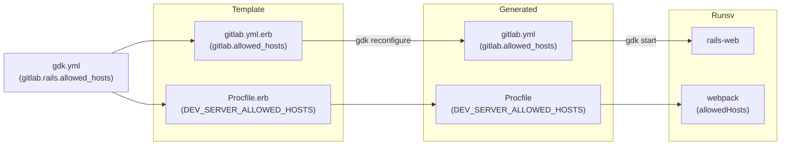

# Configuration

This document describes how you can configure your GDK environment.

- [Git configuration](#git-configuration).
- [GDK configuration](#gdk-configuration).
- [Webpack settings](#webpack-settings).
- [Grafana settings](#grafana-settings).
- [`asdf` settings](#asdf-settings).

## Git configuration

Git has features which are disabled by default, and would be great to enable to
be more effective with Git. Run `rake git:configure` to set the recommendations
for some repositories within the GDK.

To set the configuration globally, run `rake git:configure[true]`. When using
`zsh`, don't forget to escape the square brackets: `rake git:configure\[true\]`.

## GDK configuration

GDK can be configured using either:

- [`gdk.yml`](#gdkyml) configuration file.
- [Loose files](#loose-files-deprecated) (deprecated).

### `gdk.yml`

You can override the GDK's default settings with a `gdk.yml` in the GDK root,
which is the only supported configuration method.

To see available configuration settings, see [`gdk.example.yml`](../gdk.example.yml).

This file contains all possible settings with example values. Note
that these values may not be the default that GDK uses.

If you want to check which settings are in place, you can run `rake dump_config`, which prints
all applied settings in a YAML structure.

- [Notable settings](#notable-settings)
- [GDK settings](#gdk-settings)
- [GitLab settings](#gitlab-settings)
- [GitLab Docs settings](#gitlab-docs-settings)
- [Additional projects settings](#additional-projects-settings)
- [NGINX settings](#nginx-settings)

#### Run GitLab and GitLab FOSS concurrently

To have multiple GDK instances running concurrently, for example to test GitLab and GitLab FOSS,
initialize each into a separate GDK folder. To run them simultaneously, make sure they don't use
conflicting port numbers.

For example, you can create the following `gdk.yml` in the GitLab FOSS GDK to customise to avoid conflicting port numbers:

```yaml
port: 3001
webpack:
  port: 3809
gitlab_pages:
  port: 3011
```

#### Overwriting configuration files

Any configuration file managed by GDK is overwritten
whenever there are changes in its source (a `.example` or `.erb`
file). When GDK overwrites a configuration file it moves the original file
into the `.backups` subdirectory of your GDK installation.

If you have local changes that you don't want GDK to touch you can
protect individual configuration files. For example:

```yaml
# in gdk.yml
gdk:
  protected_config_files:
  - 'gitaly/*.toml'
```

> Note that `gdk.yml` is not managed by GDK and GDK never overwrites it.

#### Notable settings

Here are a few settings worth mentioning:

| Setting                          | Default               | Description                                                                                |
|--------------------------------- |-----------------------|--------------------------------------------------------------------------------------------|
| `listen_address`                 | `127.0.0.1`           | Select the IP for GDK to listen on. Note, this is occasionally used as a hostname/URL (when running feature specs for example), so using 0.0.0.0 can be problematic. |
| `port`                           | `3000`                | Select the port to run GDK on, useful when running multiple GDKs in parallel.              |
| `webpack.port`                   | `3808`                | Also useful to configure when running GDKs in parallel. [See below for more webpack options](#webpack-settings). |
| `gitlab.rails.bundle_gemfile`    | `Gemfile`             | Set this to where GitLab should look for Gemfile. |
| `gitlab.cache_classes`           | `false`               | Set this to `true` to disable the automatic reloading of Ruby classes when Ruby code is changed. |
| `gitlab.default_branch`          |  `master`             | Set this to the desired default branch name in the GitLab repository. |
| `gitlab.gitaly_disable_request_limits`  | `false`        | Set this to `true` to disable Gitaly request limit checks in development. |
| `gitlab_pages.host`              | `127.0.0.1.nip.io`    | Specify GitLab Pages hostname. See also the [Pages guide](howto/pages.md#hostname). |
| `gitlab_pages.port`              | `3010`                | Specify on which port GitLab Pages should run. See also the [Pages guide](howto/pages.md#port). |
| `relative_url_root`              | `/`                   | When you want to test GitLab being available on a different path than `/`. For example, `/gitlab`. |
| `object_store.enabled`           | `false`               | Set this to `true` to enable Object Storage with MinIO.                                    |
| `object_store.consolidated_form` | `false`               | Set this to `true` to use the [consolidated object storage configuration](https://docs.gitlab.com/ee/administration/object_storage.html#consolidated-object-storage-configuration). Required for Microsoft Azure. |
| `object_store.connection`        | See `gdk.example.yml` | Specify the [object storage connection settings](https://docs.gitlab.com/ee/administration/object_storage.html#connection-settings).
| `registry.enabled`               | `false`               | Set this to `true` to enable container registry.                                           |
| `geo.enabled`                    | `false`               | Set this to `true` to enable Geo (for now it just enables `postgresql-geo` and `geo-cursor` services). |
| `gitlab.rails.puma.workers`      | `2`                   | Set this to `0` to prevent Puma (webserver) running in a [Clustered mode](https://github.com/puma/puma/blob/master/docs/architecture.md). Running in Single mode provides significant memory savings if you work within a [memory-constrained environment](https://gitlab.com/groups/gitlab-org/-/epics/5303). |
| `restrict_cpu_count`             | `-1` (not restricted) | Set the number of CPUs used when calling `bundle`. Defaults to using the number of CPUs available. |

For example, to change the port GDK is accessible on, you can set this in your `gdk.yml`:

```yaml
port: 3001
```

And run the following command to apply the change:

```shell
gdk reconfigure
```

##### Object storage configuration

The following examples are a quick guide for configuring object storage
for external S3 providers, Google Cloud Storage, or Microsoft Azure.
See the [object storage settings](https://docs.gitlab.com/ee/administration/object_storage.html).
You should set `consolidated_form` to `true`.

In development, you may also use a single bucket for testing.

###### External S3 providers

```yaml
object_store:
  enabled: true
  consolidated_form: true
  connection:
    provider: 'AWS'
    aws_access_key_id: '<YOUR AWS ACCESS KEY ID>'
    aws_secret_access_key: '<YOUR AWS SECRET ACCESS KEY>'
  objects:
    artifacts:
      bucket: artifacts
    external_diffs:
      bucket: external-diffs
    lfs:
      bucket: lfs-objects
    uploads:
      bucket: uploads
    packages:
      bucket: packages
    dependency_proxy:
      bucket: dependency_proxy
    terraform_state:
      bucket: terraform
    pages:
      bucket: pages
    ci_secure_files:
      bucket: ci-secure-files
```

###### Google Cloud Storage

```yaml
object_store:
  enabled: true
  consolidated_form: true
  connection:
    provider: 'Google'
    google_project: '<YOUR GOOGLE PROJECT ID>'
    google_json_key_location: '<YOUR PATH TO GCS CREDENTIALS>'
  objects:
    artifacts:
      bucket: artifacts
    external_diffs:
      bucket: external-diffs
    lfs:
      bucket: lfs-objects
    uploads:
      bucket: uploads
    packages:
      bucket: packages
    dependency_proxy:
      bucket: dependency_proxy
    terraform_state:
      bucket: terraform
    pages:
      bucket: pages
    ci_secure_files:
      bucket: ci-secure-files
```

###### Microsoft Azure Blob storage

To make Microsoft Azure Blob storage work, `consolidated_form` must be
set to `true`:

```yaml
object_store:
  enabled: true
  consolidated_form: true
  connection:
    provider: 'AzureRM'
    azure_storage_account_name: '<YOUR AZURE STORAGE ACCOUNT>'
    azure_storage_access_key: '<YOUR AZURE STORAGE ACCESS KEY>'
  objects:
    artifacts:
      bucket: artifacts
    external_diffs:
      bucket: external-diffs
    lfs:
      bucket: lfs-objects
    uploads:
      bucket: uploads
    packages:
      bucket: packages
    dependency_proxy:
      bucket: dependency_proxy
    terraform_state:
      bucket: terraform
    pages:
      bucket: pages
    ci_secure_files:
      bucket: ci-secure-files
```

#### GDK settings

There are also a few settings that configure the behavior of GDK itself:

| Setting                           | Default | Description                                                                                      |
|-----------------------------------|---------|--------------------------------------------------------------------------------------------------|
| `gdk.ask_to_restart_after_update` | `true`  | Set this to `false` if you do not wish to be prompted to restart your GDK after an update. |
| `gdk.debug`                       | `false` | Set this to `true` to enable increased output. |
| `gdk.overwrite_changes`           | `false` | When set to `true`, `gdk reconfigure` overwrites files and move the old version to `.backups`.|
| `gdk.protected_config_files`      | `[]`    | Contains file names / globs of configuration files GDK should not overwrite. |
| `gdk.runit_wait_secs`             | `20`    | The number of seconds `runit` waits. `runit` is used behind the scenes for `gdk stop/start/restart`. |
| `gdk.quiet`                       | `true`  | Set this to `false` to increase the level of output when updating the GDK. |
| `gdk.auto_reconfigure`            | `true`  | Set this to `false` to not run a `gdk reconfigure` after a successful `gdk update`. |
| `gdk.auto_rebase_projects`        | `false` | Set this to `true` to automatically rebase projects as part of a `gdk update`. |
| `gdk.system_packages_opt_out`     | `false` | Set this to `true` if you don't want GDK to manage installation of system packages. |
| `gdk.preflight_checks_opt_out`    | `false` | Set this to `true` if you don't want GDK to check whether your [platform is supported](../README.md#supported-platforms). This setting is unsupported. |

##### Experimental GDK settings

Experimental settings may be promoted to stable settings or they may be deprecated.

| Setting | Default | Description |
|---------|---------|-------------|
| `gdk.experimental.auto_reconfigure` | `true`  | Set this to `true` to automatically run a `gdk reconfigure` after a successful `gdk update`. |
| `gdk.experimental.quiet` | `true`  | Set this to `true` to reduce the level of output when updating the GDK. |
| `gdk.experimental.ruby_services` | `false` | Set this to `true` to use pure Ruby services instead of relying upon the `Procfile`. |

##### Hooks

Before and after hooks are supported for `gdk start`, `gdk stop`, and `gdk update`.

NOTE:
Hooks are executed with the GDK root directory as the working directory. Execution halts if a command completes with a non-zero exit code.

| Setting                    | Default | Description                                                         |
|----------------------------|---------|---------------------------------------------------------------------|
| `gdk.start_hooks.before`   | `[]`    | Array of commands to be executed sequentially before `gdk start`.   |
| `gdk.start_hooks.after`    | `[]`    | Array of commands to be executed sequentially after `gdk start`.    |
| `gdk.stop_hooks.before`    | `[]`    | Array of commands to be executed sequentially before `gdk stop`.    |
| `gdk.stop_hooks.after`     | `[]`    | Array of commands to be executed sequentially after `gdk stop`.     |
| `gdk.update_hooks.before`  | `[]`    | Array of commands to be executed sequentially before `gdk update`.  |
| `gdk.update_hooks.after`   | `[]`    | Array of commands to be executed sequentially after `gdk update`.   |

NOTE:
When running `gdk restart`, `gdk.stop_hooks` (both before & after) are executed before restarting and `gdk.start_hooks` (both before & after) are executed after restarting.

A common use for GDK hooks is
[removing uncommitted changes to `gitlab/db/structure.sql`](troubleshooting/postgresql.md#gdk-update-leaves-gitlabdbstructuresql-with-uncommitted-changes),
or [truncating the Rails logs in `gitlab/log`](troubleshooting/ruby.md#truncate-rails-logs).

### GitLab settings

#### Rails

| Setting | Default | Description |
|---------|---------|-------------|
| `gitlab.cache_classes` | `false`  | Set this to `true` to disable the automatic reloading of Ruby classes when Ruby code is changed. |
| `gitlab.rails.hostname` | `127.0.0.1` | Specify the hostname value that Rails uses when generating URLs. |
| `gitlab.rails.port` | `3000` | Specify the port value that Rails uses when generating URLs. |
| `gitlab.rails.https.enabled` | `false` | Specify if HTTPS is enabled which Rails uses when generating URLs. |
| `gitlab.rails.address` | `''`     | Specify whether Rails should listen to a UNIX socket or a TCP port. Useful for debugging with Wireshark. Use `host:port` to listen on a TCP port. Do **not** include `http://`. |
| `gitlab.rails.multiple_databases` | `false` | Deprecated. Use `gitlab.rails.databases.ci` instead. Set this to `true` to configure [multiple database connections](https://docs.gitlab.com/ee/development/database/multiple_databases.html) in your `config/database.yml`. |
| `gitlab.rails.databases.ci.enabled` | `true` | Set this to `true` to configure [multiple database connections](https://docs.gitlab.com/ee/development/database/multiple_databases.html) in your `config/database.yml`. |
| `gitlab.rails.databases.ci.use_main_database` | `false` | When `true`, the CI database connection uses the same database as the main database (`gitlabhq_development`). When `false`, it uses a distinct database (`gitlabhq_development_ci`). Only relevant when `gitlab.rails.databases.ci.enabled` is enabled. |
| `gitlab.rails.puma.workers` | `2` | Set this to `0` to prevent Puma (webserver) running in a [Clustered mode](https://github.com/puma/puma/blob/master/docs/architecture.md). Running in Single mode provides significant memory savings if you work within a [memory-constrained environment](https://gitlab.com/groups/gitlab-org/-/epics/5303). |
| `gitlab.rails.bootsnap` | `true` | Set this to `false` to disable [Bootsnap](https://github.com/Shopify/bootsnap). |
| `gitlab.rails.allowed_hosts` | `[]` | Allows Rails to serve requests from specified hosts, other than its GDK's host. Configure this setting to allow a Geo primary site to handle forwarded requests from a Geo secondary site using a different `hostname`. When this setting is configured, the hosts are also added to the `webpack.allowed_hosts` setting. Example value: `["gdk2.test"]`. |
| `gitlab.rails.application_settings_cache_seconds` | `60` | Sets the [application settings cache interval](https://docs.gitlab.com/ee/administration/application_settings_cache.html). Set to `0` to have changes take immediate effect, at the cost of loading the `application_settings` table for every request causing extra load on Redis and/or PostgreSQL. |

#### Rails background jobs (Sidekiq)

| Setting | Default | Description l|
|---------|---------|-------------
| `gitlab.rails_background_jobs.verbose` | `false`  | Set this to `true` to increase the level of logging Sidekiq produces. |
| `gitlab.rails_background_jobs.timeout` | `10`  | Set this to the number of seconds to ask Sidekiq to wait before forcibly terminating. |

### GitLab Docs settings

Under the `gitlab_docs` key, you can define the following settings:

| Setting                   | Default | Description                                                                                              |
|:--------------------------|:--------|:---------------------------------------------------------------------------------------------------------|
| `gitlab_docs.enabled`     | `false` | Set to `true` to enable [`gitlab-docs`](https://gitlab.com/gitlab-org/gitlab-docs) to be managed by GDK. |
| `gitlab_docs.auto_update` | `true`  | Set to `false` to disable updating the `gitlab-docs` checkout.                                           |
| `gitlab_docs.port`        | `3005`  | The port for `nanoc` to listen on.                                                                       |
| `gitlab_docs.https`       | `false` | Set to `true` to run the Docs site under [HTTPS](howto/nginx.md).                                        |
| `gitlab_docs.port_https`  | `3030`  | The port for `nanoc` to listen on when [HTTPS](howto/nginx.md) is enabled.                               |

For more information on using GitLab Docs with GDK, see the [GitLab Docs how to](howto/gitlab_docs.md).

### Snowplow Micro

Under the `snowplow_micro` key, you can define the following settings:

| Setting                      | Default                           | Description                                                                                              |
|:-----------------------------|:----------------------------------|:---------------------------------------------------------------------------------------------------------|
| `snowplow_micro.enabled`     | `false`                           | Set to `true` to enable [`snowplow-micro`](howto/snowplow_micro.md) to be managed by GDK.                                         |
| `snowplow_micro.image`       | `snowplow/snowplow-micro:latest`  | Docker image to run.                                                                                     |
| `snowplow_micro.port`        | `9091`                            | The port for `snowplow-micro` to listen on.                                                              |

### Additional projects settings

You can have GDK manage checkouts for these projects:

- `gitlab-runner`
- `gitlab-pages`
- `omnibus-gitlab`
- `charts/gitlab`
- `cloud-native/gitlab-operator`

Under the `gitlab_runner` key, you can define the following settings:

| Setting                      | Default | Description                                                                                                  |
|:-----------------------------|:--------|:-------------------------------------------------------------------------------------------------------------|
| `gitlab_runner.enabled`      | `false` | Set to `true` to enable [`gitlab-runner`](https://gitlab.com/gitlab-org/gitlab-runner) to be managed by GDK. |
| `gitlab_runner.auto_update`  | `true`  | Set to `false` to disable updating the `gitlab-runner` checkout.                                             |

Under the `gitlab_pages` key, you can define the following settings:

| Setting                                  | Default                          | Description                                                                                                 |
|:-----------------------------------------|:---------------------------------|:------------------------------------------------------------------------------------------------------------|
| `gitlab_pages.enabled`                   | `false`                          | Enable [`gitlab-pages`](https://gitlab.com/gitlab-org/gitlab-pages) to be managed by GDK.                   |
| `gitlab_pages.auto_update`               | `true`                           | Set to `false` to disable updating the `gitlab-pages` checkout.                                             |
| `gitlab_pages.host`                      | `127.0.0.1.nip.io`               | Set `gitlab-pages` host.                                                                                    |
| `gitlab_pages.port`                      | `3010`                           | Set `gitlab-pages` port.                                                                                    |
| `gitlab_pages.secret_file`               | `$GDK_ROOT/gitlab-pages-secret`  | Set `gitlab-pages` file that contains the secret to communicate in the internal API.                        |
| `gitlab_pages.verbose`                   | `false`                          | Set `gitlab-pages` verbose logging.                                                                         |
| `gitlab_pages.propagate_correlation_id`  | `false`                          | Set `gitlab-pages` to propagate the `correlation_id` received.                                              |
| `gitlab_pages.access_control`            | `false`                          | Enable `gitlab-pages` access control.                                                                       |
| `gitlab_pages.auth_client_id`            | `''`                             | The OAuth application ID used when access control is enabled.                                               |
| `gitlab_pages.auth_client_secret`        | `''`                             | The OAuth client secret used when access control is enabled.                                                |
| `gitlab_pages.auth_scope`                | `'api'`                          | The OAuth client scope used when access control is enabled.                                                 |
| `gitlab_pages.enable_custom_domains`     | `false`                          | Enable `gitlab-pages` custom domains.                                                                       |

For further details check the [Contribute to GitLab Pages development](https://docs.gitlab.com/ee/development/pages/) documentation.

Under the `omnibus_gitlab` key, you can define the following settings:

| Setting                       | Default | Description                                                                                                    |
|:------------------------------|:--------|:---------------------------------------------------------------------------------------------------------------|
| `omnibus_gitlab.enabled`      | `false` | Set to `true` to enable [`omnibus-gitlab`](https://gitlab.com/gitlab-org/omnibus-gitlab) to be managed by GDK. |
| `omnibus_gitlab.auto_update`  | `true`  | Set to `false` to disable updating the `omnibus-gitlab` checkout.                                              |

Under the `charts_gitlab` key, you can define the following settings:

| Setting                      | Default | Description                                                                                                  |
|:-----------------------------|:--------|:-------------------------------------------------------------------------------------------------------------|
| `charts_gitlab.enabled`      | `false` | Set to `true` to enable [`charts/gitlab`](https://gitlab.com/gitlab-org/charts/gitlab) to be managed by GDK. |
| `charts_gitlab.auto_update`  | `true`  | Set to `false` to disable updating the `charts/gitlab` checkout.                                             |

Under the `gitlab_operator` key, you can define the following settings:

| Setting                       | Default | Description                                                                                                                                |
|:------------------------------|:--------|:-------------------------------------------------------------------------------------------------------------------------------------------|
| `gitlab_operator.enabled`     | `false` | Set to `true` to enable [`cloud-native/gitlab-operator`](https://gitlab.com/gitlab-org/cloud-native/gitlab-operator) to be managed by GDK. |
| `gitlab_operator.auto_update` | `true`  | Set to `false` to disable updating the `cloud-native/gitlab-operator` checkout.                                                            |

NOTE:
If you set `enabled` to `true` for  `gitlab-runner`, `omnibus-gitlab`, `charts/gitlab`, `gitlab_operator` projects, you
can [live preview documentation changes](howto/gitlab_docs.md#make-documentation-changes).

### NGINX settings

| Setting | Default | Description |
|---------|---------|-------------|
| `nginx.enabled` | `false` | Set this to `true` to enable the `nginx` service. |
| `nginx.listen` | `127.0.0.1` | Set this to the IP for NGINX to listen on. |
| `nginx.bin` | `/usr/sbin/nginx` | Set this to the path to your `nginx` binary. |
| `nginx.ssl.certificate` | `localhost.crt` | This maps to [NGINX's `ssl_certificate`](https://nginx.org/en/docs/http/ngx_http_ssl_module.html#ssl_certificate). |
| `nginx.ssl.key` | `localhost.key` | This maps to [NGINX's `ssl_certificate_key`](https://nginx.org/en/docs/http/ngx_http_ssl_module.html#ssl_certificate_key). |
| `nginx.http2.enabled` | `false` | Set this to `true` to enable HTTP/2 support. |

See [configuring NGINX](howto/nginx.md) for a comprehensive guide.

### Loose files (deprecated)

Before `gdk.yml` was introduced, GDK could be configured through a
bunch of loose files, where each file sets one setting.

It is no longer possible to have these, and GDK will fail when it detects a
loose file. To continue using GDK, you'll have to move these settings to
`gdk.yml`. Below is a table of all the loose files and their corresponding
setting.

| Filename                     | YAML setting                           |
|------------------------------|----------------------------------------|
| `host` / `hostname`          | `hostname`                             |
| `port`                       | `port`                                 |
| `https_enabled`              | `https.enabled`                        |
| `relative_url_root`          | `relative_url_root`                    |
| `webpack_host`               | `webpack.host`                         |
| `webpack_port`               | `webpack.port`                         |
| `registry_enabled`           | `registry.enabled`                     |
| `registry_port`              | `registry.port`                        |
| `registry_image`             | `registry.image`                       |
| `object_store_enabled`       | `object_store.enabled`                 |
| `object_store_port`          | `object_store.port`                    |
| `postgresql_port`            | `postgresql.port`                      |
| `postgresql_geo_port`        | `postgresql.geo.port`                  |
| `gitlab_pages_port`          | `gitlab_pages.port`                    |
| `google_oauth_client_secret` | `omniauth.google_oauth2.client_secret` |
| `google_oauth_client_id`     | `omniauth.google_oauth2.client_id`     |

### Configuration precedence

GDK uses the following order of precedence when selecting the
configuration method to use:

- `gdk.yml`
- Default value

### Reading the configuration

To print settings from the configuration you can use `gdk config get <setting>`.

More information on the available `gdk` commands is found in [GDK commands](gdk_commands.md).

### Implementation detail

Here are some details on how the configuration management is built.

#### GDK::ConfigSettings

This is the base class and the engine behind the configuration
management. It defines a DSL to configure GDK.

Most of the magic happens through the class method
`.method_missing`. The implementation of this method dynamically
defines instance methods for configuration settings.

Below is an example subclass of `GDK::ConfigSettings` to demonstrate
each kind.

```ruby
class ExampleConfig < GDK::ConfigSettings
  foo 'hello'
  bar { rand(1..10) }
  fuz do |f|
    f.buz 1234
  end
end
```

- `foo`: (literal value) This is just a literal value, it can be any
  type (for example, Number, Boolean, String).
- `bar`: (block without argument) This is using a block to set a
  value. It evaluates the Ruby code to dynamically calculate a value.
- `fuz`: (block with argument) When the block takes a single argument,
  it expects you are setting child settings.

If you'd dump this configuration with `rake dump_config`, you get something
like:

```yaml
foo: hello
bar: 5
fuz:
  buz: 1234
```

When you use a block without argument you can also calculate a value
based on another setting. So for example, we'd could replace the `bar`
block with `{ config.fuz.buz + 1000 }` and then the value would be
`2234`.

#### `GDK::Config`

`GDK::Config` is the single source of truth when it comes down to
defaults. In this file, every existing setting is specified and for
each setting a default is provided.

#### Dynamic settings

Some settings in `GDK::Config` are prepended with `__` (double
underscore). These are not supposed to be set in `gdk.yml` and only
act as a intermediate value. They also are not shown by `#dump!`.

### Adding a setting

When you add a new setting:

1. Add it to `lib/gdk/config.rb`.
1. Run `rake gdk.example.yml` to regenerate this file.
1. Commit both files.

## Runner settings

Under the runner key you can define the following settings for the [GitLab Runner](https://docs.gitlab.com/runner/):

| Setting | Default | Description |
| --- | ------ | ----- |
| `enabled` | `false` | Set this to `true` to enable the `runner` service. |
| `config_file` | `$GDK_ROOT/gitlab-runner-config.toml` | Path to your runner's `config.toml`. Defaults to GDK-managed config file. |
| `install_mode` | `binary` | Set this to `docker` in order to create a Docker container instead of using a local `gitlab-runner` binary. |
| `executor` | `docker` | Set this to `shell` if you want to use a shell executor. |
| `image` | `gitlab/gitlab-runner:latest` | Docker image to use for the runner when using `install_mode: docker`. |
| `docker_pull` | `always` | Docker pull option when running the runner Docker image. For available options, see [`docker run`](https://docs.docker.com/engine/reference/commandline/run/#pull) documentation. |
| `pull_policy` | `if-not-present` | Docker pull policy for the job image. |
| `bin` | `/usr/loca/bin/gitlab-runner` | Path to local runner binary when using `install_mode: binary`. |
| `extra_hosts` | `[]` | Sets the value of the `extra_hosts = []` key under `[runners.docker]` in the runner config. If using the Docker runner, these hosts are added to the container as `--add-host` flags. |
| `network_mode_host` | `false` | Set this to `true` to set `network_mode = "host"` for the `[runners.docker]` section (only on Linux). |
| `token` | Empty | Runner token to add to the runner config. |

## Vite settings

[Vite](https://vitejs.dev/) offers an improved developer experience by default.

Vite compiles JavaScript and Vue files quickly and only as requested.
Vite also consumes less memory.

These improvements are possible because Vite uses [esbuild](https://esbuild.github.io/) under the hood.
For more details on the implementation of Vite at GitLab, see the RFC [frontend/rfcs#106](https://gitlab.com/gitlab-org/frontend/rfcs/-/issues/106).

If you are using Vite, please [leave feedback](https://gitlab.com/gitlab-org/gitlab/-/issues/423851) of your experience.
There are some known caveats, they are linked to the feedback issue. Please make sure to check those. There are two caveats worth calling out:

1. `vite` serves files directly, so ad blockers might [block them based on their name](https://gitlab.com/gitlab-org/gitlab/-/issues/433361).
   The workaround is to turn ad blockers off for the GDK.
1. `vite` on Linux watches a lot of files, so you might need to raise the [max_watch_files](https://gitlab.com/gitlab-org/gitlab/-/issues/434329) limit.

To enable Vite for your GDK:

1. Ensure that your `gdk` is up to date (`gdk update`)
1. Ensure the `gdk` is running with webpack.
1. If you ran `vite` manually before, make sure no process remains.
1. Run the following commands to setup Vite:

      ```shell
      echo "Feature.enable(:vite)" | gdk rails c # Enable the Vite feature flag. This is needed for some older branches.
      gdk stop webpack rails-web # Stop the Rails app and webpack.
      gdk config set webpack.enabled false # Disable webpack.
      gdk config set vite.enabled true # Enable Vite.
      gdk reconfigure # Update the config files.
      gdk restart vite rails-web # Restart the Rails app and Vite as the developer server.
      ```

To disable Vite, run the following commands:

```shell
echo "Feature.disable(:vite)" | gdk rails c
gdk stop vite rails-web
gdk config set vite.enabled false
gdk config set webpack.enabled true
gdk reconfigure
gdk restart webpack rails-web
```

Vite support is new.
If you encounter any errors, the branch you are on might be too old.
Consider rebasing your local branch.
You can quickly check whether your branch *should* work:

```shell
git merge-base --is-ancestor 0e35808bc7c HEAD
```

### Vite `gdk.yml` settings

| Setting   | Default | Description                                                                                                  |
|-----------|---------|--------------------------------------------------------------------------------------------------------------|
| `enabled` | `false` | Set to `true` to enable Vite.                                                                                |
| `port`    | `3038`  | The port your Vite development server is running on. You should change this if you are running multiple GDKs. |

## Webpack settings

The GDK ships with [`vite` support](#vite-settings). Consider trying it for a better developer experience.

### Webpack `gdk.yml` settings

Under the webpack key you can define the following settings with their defaults:

```yaml
webpack:
  enabled: true
  host: 127.0.0.1
  port: 3808
  static: false
  vendor_dll: false
  incremental: true
  incremental_ttl: 30
  allowed_hosts: []
```

| Setting | Default | Description |
| --- | ------ | ----- |
| `enabled` | `true` | Set to `false` to disable webpack. |
| `host` | `127.0.0.1` | The host your webpack development server is running on. Usually no need to change. |
| `port` | `3808` | The port your webpack development server is running on. You should change this if you are running multiple GDKs |
| `static` | `false` | Setting this to `true` replaces the webpack development server with a lightweight Ruby server with. See below for more information |
| `vendor_dll` | `false` | Setting this to `true` moves certain dependencies to a webpack DLL. See below for more information |
| `incremental` | `true` | Setting this to `false` disables incremental webpack compilation. See below for more information |
| `incremental_ttl` | `30` | Sets the number of days after which a visited page's assets will be evicted from the list of bundles to eagerly compile. Set to `0` to eagerly compile every page's assets ever visited. |
| `sourcemaps` | `true` | Setting this to `false` disables source maps. This reduces memory consumption for those who do not need to debug frontend code. |
| `live_reload` | `true` | Setting this to `false` disables hot module replacement when changes are detected. |
| `public_address` | `` | Allows to set a public address for webpack's live reloading feature. This setting is mainly utilized in GitPod, otherwise the address should be set correctly by default. |
| `allowed_hosts` | `[]` | Webpack can serve requests from hosts other than its GDK's host. Use this setting on a Geo primary site that serves requests forwarded by Geo secondary sites. Defaults to `gitlab.rails.allowed_hosts`. You don't usually need to set this for Webpack. Example value: `["gdk2.test"]`. |

#### Incremental webpack compilation

By default, webpack only compiles page bundles for pages that were visited
within the last `webpack.incremental_ttl` days. This is done to keep the memory
consumption of the webpack development server low. If you visit a previously
unvisited page or one visited longer than `webpack.incremental_ttl` days ago,
you see an overlay informing you that the page is being compiled. A page reload
(either manually or via `live_reload`) then ensures the correct assets are
served.

You can change the number of days that page bundles are considered "recent",
and should be eagerly compiled. This number represents the trade-off between
lazy/eager compilation versus low/high memory consumption of the webpack
development server. A higher number means fewer pages needing to be compiled on
demand, at the cost of higher memory consumption. A lower number means lower
memory consumption, at the cost of more pages being compiled on demand. A value
of `0` means that all pages in your history, regardless of how long ago you
visited them, are eagerly compiled.

For instance, if you visited a particular page `webpack.incremental_ttl - 1`
days ago, it would render as normal if you visited it _today_. But, if instead
you visit it _tomorrow_, you would see an initial "compiling" overlay.

The history of previously visited pages is stored in the `WEBPACK_CACHE_PATH`
directory. Clearing this directory will lose that history, meaning subsequent
page visits will trigger on demand compilation. Over time, your history will be
rebuilt.

To disable incremental compilation entirely and always eagerly compile all page
bundles, set `webpack.incremental: false` in your `gdk.yml`.

#### Saving memory on the webpack development server

GDK defaults to mostly memory-intensive settings. GDK uses the webpack development server, which watches
file changes and keeps all the frontend assets in memory. This allows for very fast recompilation.

An alternative is to lower the memory requirements of GDK. This is useful for back-end development
or where GDK is running in lower-memory environments. To lower the memory requirements of GDK:

- Set `webpack.static: true` in your `gdk.yml`. All frontend assets are compiled once when GDK starts
  and again from scratch if any front-end source or dependency file changes. For example, when
  switching branches.
- Set `webpack.vendor_dll: true` in your `gdk.yml`. This mode is an alternate memory saving mode,
  which takes infrequently updated dependencies and combines them into one long-lived bundle that is
  written to disk and does not reside in memory. You may see 200 to 300 MB in memory savings.
- Reduce the value of `webpack.incremental_ttl` in your `gdk.yml`. This means
  fewer page bundles will be eagerly compiled.

This means you pay a high upfront cost of a single memory- and CPU-intensive compile. However, if
you do not change any frontend files, you just have a lightweight Ruby server running.

If you experience any problems with one of the modes, you can quickly change the settings in your
`gdk.yml` and regenerate the `Procfile`:

```shell
gdk reconfigure
```

#### Webpack allowed hosts

By default, webpack only accepts requests with a `Host` header that matches the GDK `hostname`. This is a secure default. But sometimes you may
want webpack to accept requests from other known hosts.

The `webpack.allowed_hosts` setting takes an array of strings, for example `["gdk2.test", "gdk3.test"]`.

When `webpack.allowed_hosts` is not explicitly configured in `gdk.yml`, it defaults to `gitlab.rails.allowed_hosts`. In that case, the
configuration flow is:



##### Example

As an example:

- Your GDK `hostname` is `gdk.test`.
- You are running another GDK locally as a Geo secondary site with `hostname` set to `gdk2.test`.

As a result, web requests against `gdk2.test` reference webpack URLs for `gdk2.test` at the **same port** as the primary webpack. Web requests
are made to the same port because the Geo secondary site proxies most web requests to the primary site and so the primary site renders the
webpack links.

The `Host` of the original request is propagated to the primary site, and the primary site renders URLs with that `Host`. However, the primary
site has no way of knowing if the secondary site is running webpack at a different port. You can't run two webpack servers locally, listening on
the same port for different hosts.

So what options do you have to make this work? You can either:

- Run your `gdk2.test` site on a different IP.
- Let the `gdk2.test` webpack requests reach the primary site's webpack server. The requests would get blocked by default, and then you could
  unblock them with `webpack.allowed_hosts` setting.

  In this case, you would already set `gitlab.rails.allowed_hosts` to `["gdk2.test"]`. This is why `webpack.allowed_hosts` defaults to
  `gitlab.rails.allowed_hosts`.

### Webpack environment variables

The GitLab application exposes various configuration options for webpack via
environment variables. These can be modified to improve performance or enable debugging.

These settings can be configured using [`env.runit`](runit.md#modifying-environment-configuration-for-services).

<!-- markdownlint-disable MD044 -->

| Variable | Default | Description |
| ------------- | ------- | ----------- |
| DEV_SERVER_LIVERELOAD | true | Disables live reloading of frontend assets |
| NO_COMPRESSION        | false | Disables compression of assets |
| NO_SOURCEMAPS         | false | Disables generation of source maps (reduces size of `main.chunk.js` by ~50%) |
| WEBPACK_MEMORY_TEST   | false | Output the in-memory heap size upon compilation and exit |
| WEBPACK_CACHE_PATH    | `./tmp/cache` | Path string to temporary dir     |
| WEBPACK_REPORT        | false       | Generates bundle analysis report |
| WEBPACK_VENDOR_DLL    | false       | Reduce webpack-dev-server memory requirements when vendor bundle has been precompiled with `yarn webpack-vendor` |
| GITLAB_UI_WATCH       | false | Use GDK's copy of `gitlab-ui` instead of the npm-installed version. |

<!-- markdownlint-enable MD044 -->

## ActionCable settings

Under the `action_cable` key you can define the following settings with their defaults:

```yaml
action_cable:
  worker_pool_size: 4
```

| Setting            | Default | Description |
|--------------------|---------|-------------|
| `worker_pool_size` | `4`     | Adjust this to control the number of ActionCable threads. This usually doesn't need to be changed. |

## Grafana settings

Under the `grafana` key you can define the following settings with their defaults:

```yaml
grafana:
  enabled: false
  port: 4000
```

| Setting   | Default | Description |
|-----------|---------|-------------|
| `enabled` | `false` | Set this to `true` to enable the `grafana` service. |
| `port`    | `4000`  | Set your preferred TCP port for the `grafana` service. |

## `asdf` settings

Under the `asdf` key you can define the following settings with their defaults:

```yaml
asdf:
  opt_out: false
```

| Setting   | Default | Description |
|-----------|---------|-------------|
| `opt_out` | `false` | Set this to `true` to tell GDK to _not_ use `asdf`, even if it's installed. |
