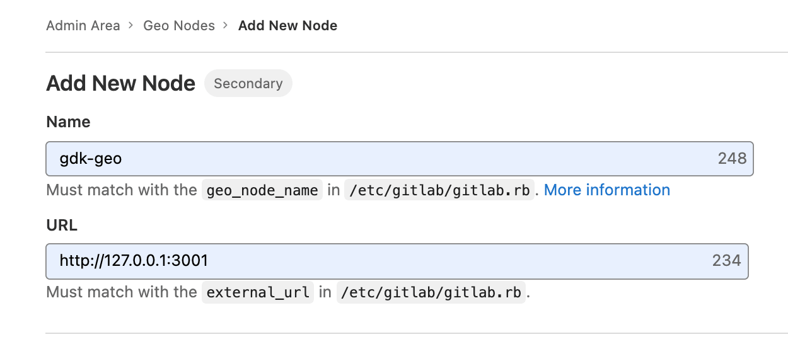

# GitLab Geo

This document instructs you to set up GitLab Geo using GDK.

Geo allows you to replicate a whole GitLab instance. Customers use this for
Disaster Recovery, as well as to offload read-only requests to secondary
instances. For more, see
[GitLab Geo](https://about.gitlab.com/solutions/geo/) or
[Replication (Geo)](https://docs.gitlab.com/ee/administration/geo/replication/).

## Prerequisites

Development on GitLab Geo requires two GDK instances running side-by-side. You can use an existing
`gdk` instance based on the [install GDK](../index.md#install-gdk) documentation as the primary
node.

### Primary

Add the following to `gdk.yml` file on the primary node:

```yaml
---
geo:
  enabled: true
```

Though this setting normally indicates the node is a secondary, many scripts and `make` targets
assume they can run secondary-specific logic on any node. That is, rather than the scripts being
node-type aware, this ensures the primary can act "like a secondary" in some cases
such as when running tests.

### Secondary

We assume your primary GDK instance lives in a parallel folder: `../gdk`,
make sure you use the correct folder name if not when looking at
the instructions below.

We create a secondary instance in a `gdk-geo` folder to act as
a secondary node. We configure unique ports for the new instance so
that it can run alongside the primary.

```shell
git clone https://gitlab.com/gitlab-org/gitlab-development-kit.git gdk-geo
cd gdk-geo
```

Add the following to `gdk.yml` file:

```yaml
---
geo:
  enabled: true
  secondary: true
  node_name: gdk-geo
gitlab_pages:
  enabled: true
  port: 3011
tracer:
  jaeger:
    enabled: false
port: 3001
webpack:
  port: 3809
```

Then run the following command:

```shell
# Assuming your primary GDK instance lives in parallel folders:
gdk install gitlab_repo=../gdk/gitlab
```

Note the `gitlab_repo` parameter is an optimization, but it is not
strictly required. It saves you time by performing a local `git clone`
instead of pulling from GitLab.com. In addition, a `git pull` in the
`gitlab` directory updates from your local primary Git repository.

After installation finishes, run the following commands:

```shell
# Run this on your primary instance folder: (../gdk)
gdk start

# Run this on your secondary instance folder: (../gdk-geo)
gdk start postgresql postgresql-geo
make geo-setup
```

### Praefect on a Geo secondary

After changing the setting of `geo.secondary` in your GDK configuration, the
Praefect database needs to be recreated. Check out the [Praefect documentation](gitaly.md#praefect-on-a-geo-secondary)
for the details.

## Database replication

For GitLab Geo, you need a primary/secondary database replication defined.
There are a few extra steps to follow.

### Prepare primary for replication

In your primary instance (`gdk`) you need to prepare the database for
replication. This requires the PostgreSQL server to be running, so we start
the server, perform the change (via a `make` task), and then kill and restart
the server to pick up the change:

```shell
# terminal window 1:
cd gdk
gdk start postgresql
make postgresql-geo-replication-primary
gdk restart postgresql
make postgresql-replication-primary-create-slot
gdk restart postgresql
```

### Set up replication on secondary

Because we replicate the primary database to the secondary, we need to
remove the secondary's PostgreSQL data folder:

```shell
# terminal window 2:
cd gdk-geo
gdk stop postgresql
rm -r postgresql/data
```

Now we need to add a symbolic link to the primary instance's data folder:

```shell
# From the gdk-geo folder:
ln -s ../gdk/postgresql postgresql-primary
```

Initialize a secondary database and setup replication:

```shell
# terminal window 2:
make postgresql-geo-replication-secondary
```

### Running tests

#### On a primary

The secondary has a read-write tracking database, which is necessary for some
Geo tests to run. However, its copy of the replicated database is read-only, so
tests fail to run.

You can add the tracking database to the primary node by running:

```shell
# From the gdk folder:
gdk start

# In another terminal window
make geo-setup
```

This adds both development and test instances, but the primary continues
to operate *as* a primary except in tests where the current Geo node has been
stubbed.

To ensure the tracking database is started, restart GDK. You need to use
`gdk start` to be able to run the tests.

#### On a secondary

When you try to run tests on a GDK configured as a Geo secondary, tests
might fail because the main database is read-only.

You can work around this by using the PostgreSQL instance that is used
for the tracking database (i.e. the one running in
`<secondary-gdk-root>/postgresql-geo`) for both the tracking and the
main database.

Add or replace the `test:` block with the following to `<secondary-gdk-root>/gitlab/config/database.yml`:

```yaml
test: &test
  adapter: postgresql
  encoding: unicode
  database: gitlabhq_test
  host: /home/<secondary-gdk-root>/postgresql-geo
  port: 5432
  pool: 10
```

## Copy database encryption key

The primary and the secondary nodes use the same secret key
to encrypt attributes in the database. To copy the secret from your primary to your secondary:

1. Open `gdk/gitlab/config/secrets.yml` with your editor of choice
1. Copy the value of `development.db_key_base`
1. Paste it into `gdk-geo/gitlab/config/secrets.yml`

## SSH cloning

To be able to clone over SSH on a secondary, follow the instruction on how
to set up [SSH](ssh.md), including [SSH key lookup from database](ssh.md#ssh-key-lookup-from-database).

## Configure Geo nodes

### Add a license that includes the Geo feature

1. Get a [test license](https://about.gitlab.com/handbook/support/workflows/test_env.html#testing-environment-license)
1. Upload the license on your local Geo primary at <http://gdk.test:3000/admin/license>

### Add primary node

1. Add the primary node:

   ```shell
   cd gdk/gitlab

   bundle exec rake geo:set_primary_node
   ```

1. Restart Rails processes:

   ```shell
   gdk restart rails
   ```

### Add secondary node

There isn't a convenient Rake task to add the secondary node because the relevant
data is on the secondary, but we can only write to the primary database. So we
must get the values from the secondary, and then manually add the node.

1. In a terminal, change to the `gitlab` directory of the secondary node:

   ```shell
   cd gdk-geo/gitlab
   ```

1. Output the secondary node's **Name** and **URL**:

   ```shell
   bundle exec rails runner 'puts "Name: #{GeoNode.current_node_name}"; puts "URL: #{GeoNode.current_node_url}"'
   ```

1. Visit the **primary** node's **Admin Area > Geo > Nodes** (`/admin/geo/nodes`)
   in your browser.
1. Click the **New node** button.
1. Fill in the **Name** and **URL** fields for the **secondary** node, using the *exact* values from step 2.
1. Click the **Save changes** button.



### Configure Unified URL

Unified URL is the recommended Geo configuration since GitLab 14.6, so it's valuable for Geo engineers to dogfood it locally.

#### Prerequisites

You have two functioning Geo sites:

<!-- markdownlint-disable MD044 -->

- One primary site at `http://gdk.test:3000`
- One secondary read-only site at `http://gdk.test:3001`

<!-- markdownlint-enable MD044 -->

#### Minimal configuration to test Unified URL

You could set up a reverse proxy at port `3002` to forward requests to either site. But here we will show a minimal way to test Unified URL:

1. Choose one site to be the one that receives your requests to the Unified URL. In this example, let's choose the secondary because it has the interesting behavior. When you visit the secondary site, and it will forward your requests to the primary when appropriate.
1. Set the primary's `geo_nodes` record's URL to be the exact same string as the secondary's URL, thus "unifying" them in the DB. This change will cause the secondary's API to tell Workhorse to enable proxying:

   ```shell
   bundle exec rails runner 'GeoNode.primary_node.update!(url: GeoNode.secondary_nodes.first.url, internal_url: GeoNode.primary_node.url)'
   ```

   In the above command, we also set the primary's `geo_nodes` record's Internal URL explicitly, since it is no longer the same URL. This is required for the secondary to be able to make requests against the primary, and to forward requests to the primary.

   This command works given the prerequisites, but if your `url` or `internal_url` ever gets misconfigured, then open a Rails console and set them manually.

1. Optional. In your primary's `gdk.yml`, add:

   ```yaml
   gitlab:
     rails:
       port: 3001
   ```

   This is like setting `external_url` for GitLab Rails only. It will make the primary generate absolute URLs matching the Unified URL. One example of an absolute URL generated by the backend is the Git remote HTTP URL on a project page.

   You can still visit the primary directly, just as you can access any GitLab instance at a different URL than its external URL. However, you may find some edge cases. Using the same example above: Git remote URLs will always point to the Unified URL regardless of the URL you are visiting the primary at.

1. Comment out the `webpack` section in the secondary's `gdk.yml`, or set the `listen_address` and `port` to be the same as on the primary if you're not using the defaults.

   After a reconfigure, the Rails webpack configuration uses the connection details of the primary webpack.

   You no longer have to start `webpack` on the secondary site, which saves memory.

   However, there are still pages that are not proxied and might not load here, including the Geo replication details for projects and designs.
   If you wish to access and modify these pages in development, you should disable unified URLs for now.

## Geo-specific GDK commands

Use the following commands to keep Geo-enabled GDK installations up to date.

- `make geo-primary-update`, run on the primary GDK node.
- `make geo-secondary-update`, run on any secondary GDK nodes.

## Upgrading to Postgres 12

Upgrading to Postgres 12 is not automated in GDK with Geo. It should be possible to manually accomplish an upgrade, but if you are not generally familiar with the process, it is recommended to set up your GDKs from scratch. The default version is now Postgres 12.

## Troubleshooting

### `postgresql-geo/data` exists but is not empty

If you see this error during setup because you have already run `make geo-setup` once:

```plaintext
initdb: directory "postgresql-geo/data" exists but is not empty
If you want to create a new database system, either remove or empty
the directory "postgresql-geo/data" or run initdb
with an argument other than "postgresql-geo/data".
make: *** [postgresql/geo] Error 1
```

Then you may delete or move that data in order to run `make geo-setup` again.

```shell
mv postgresql-geo/data postgresql-geo/data.backup
```

### GDK update command error on secondaries

You see the following error after running `gdk update` on your local Geo
secondary. It is ok to ignore. Your local Geo secondary does not have or need a
test DB, and this error occurs on the very last step of `gdk update`.

```shell
cd /Users/foo/Developer/gdk-geo/gitlab && \
      bundle exec rake db:migrate db:test:prepare
rake aborted!
ActiveRecord::StatementInvalid: PG::ReadOnlySqlTransaction: ERROR:  cannot execute DROP DATABASE in a read-only transaction
: DROP DATABASE IF EXISTS "gitlabhq_test"
/Users/foo/.rbenv/versions/2.6.3/bin/bundle:23:in `load'
/Users/foo/.rbenv/versions/2.6.3/bin/bundle:23:in `<main>'

Caused by:
PG::ReadOnlySqlTransaction: ERROR:  cannot execute DROP DATABASE in a read-only transaction
/Users/foo/.rbenv/versions/2.6.3/bin/bundle:23:in `load'
/Users/foo/.rbenv/versions/2.6.3/bin/bundle:23:in `<main>'
Tasks: TOP => db:test:load => db:test:purge
(See full trace by running task with --trace)
make: *** [gitlab-update] Error 1
```

## Enabling Docker Registry replication

For information on enabling Docker Registry replication in GDK, see
[Docker Registry replication](geo-docker-registry-replication.md).
