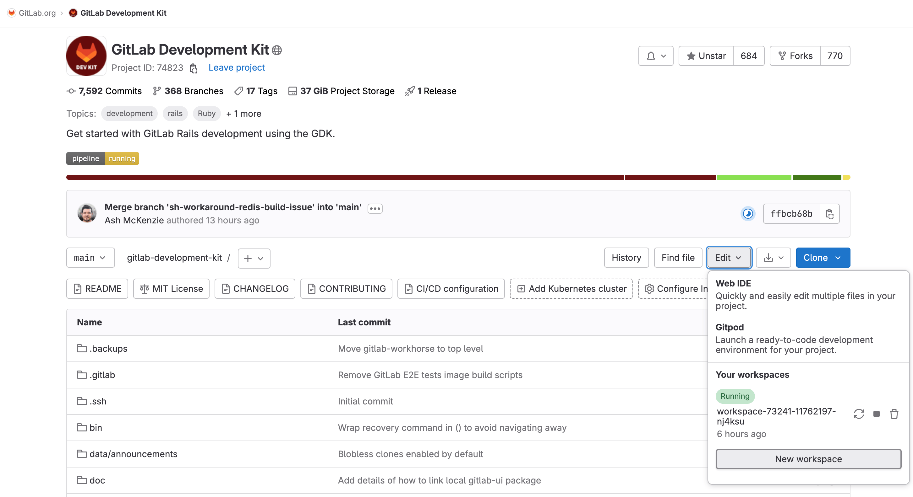
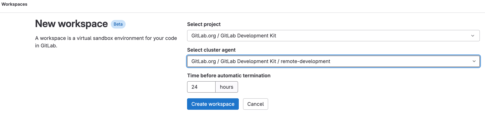
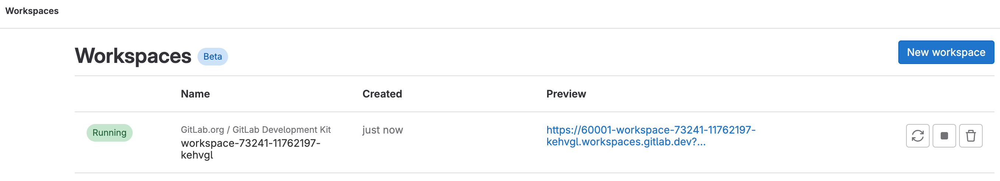
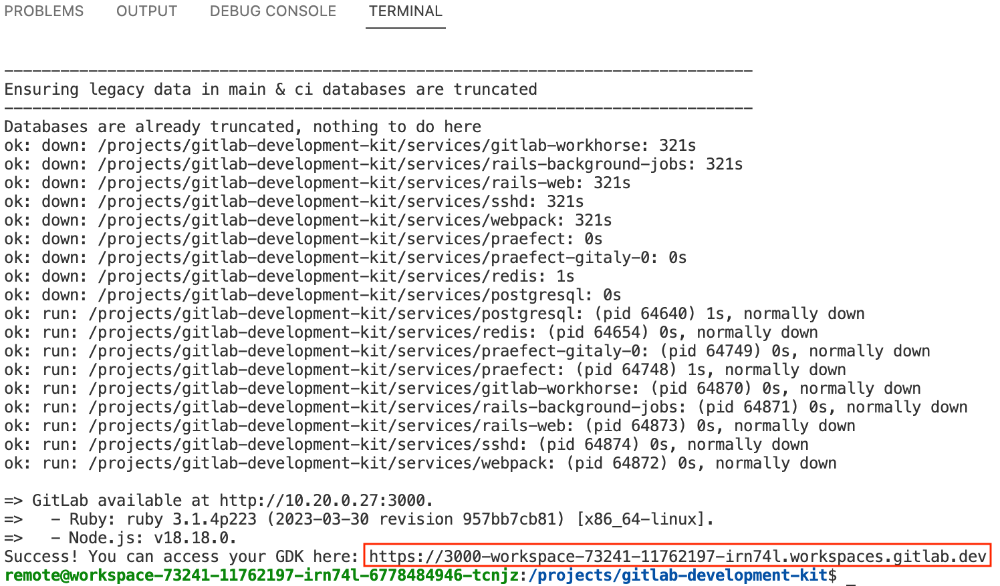

# GitLab Remote Development

## Setting up Remote Development locally

Follow the steps [here](https://gitlab.com/gitlab-org/remote-development/gitlab-remote-development-docs/-/blob/main/doc/local-development-environment-setup.md) to setup Remote Development locally.

## Develop GitLab with GitLab remote development workspaces

GDK supports [GitLab remote development workspaces (beta)](https://about.gitlab.com/releases/2023/05/22/gitlab-16-0-released/#remote-development-workspaces-available-in-beta-for-public-projects). You can use the integration to code directly in a cloud environment, which can reduce the time you spend troubleshooting issues in your local development setups.

This guide shows you how to create and connect a workspace from the GDK repository.

To learn more about remote development in GitLab, see the [remote development documentation](https://docs.gitlab.com/ee/user/project/remote_development).

This integration is available only to GitLab team members to encourage [dogfooding](https://about.gitlab.com/handbook/engineering/development/principles/#dogfooding).
[Issue #1982](https://gitlab.com/gitlab-org/gitlab-development-kit/-/issues/1982) proposes to enable the integration for open source contributors.

### Prerequisites

You must have at least the Developer role in the GDK repository.

### Create and connect a workspace

1. Go to the GDK repository and select __Edit__.
1. Select __New workspace__.

   

1. Select __GitLab Development Kit__ as your project.
1. Set the agent to __remote-development__.
1. In the __Time Before Automatic Termination__ field, specify the number of hours the workspace should stay running.

   

1. Select __Create workspace__.

Your workspace is deployed to the cluster. The deployment might take a few minutes.
After deployment, you should see a workspace under __Preview__.

### Run GDK in your workspace

1. The _Bootstrap GDK_ task starts automatically when a workspace is opened, executing the [bootstrap script](../../support/gitlab-remote-development/setup_workspace.rb).
1. After the bootstrap script finishes, you'll see a prompt asking if you want to send duration data.
1. After responding, enter any command to close the task terminal.

Your GDK should now be ready to use.

