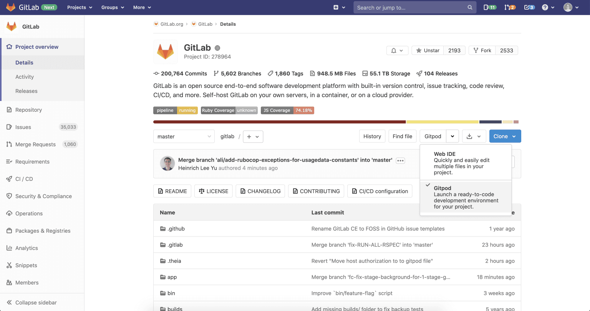
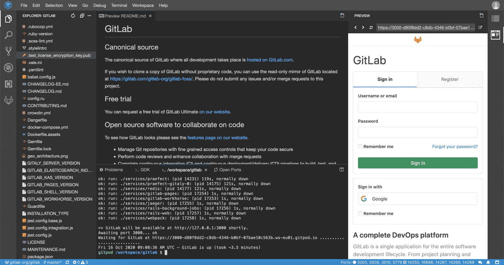
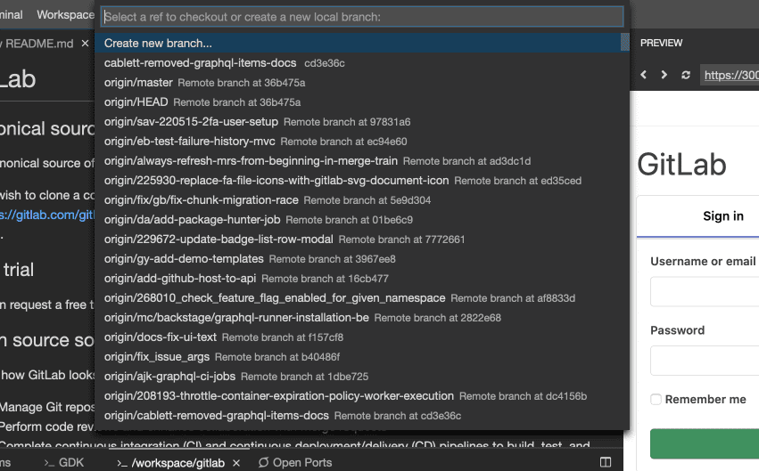
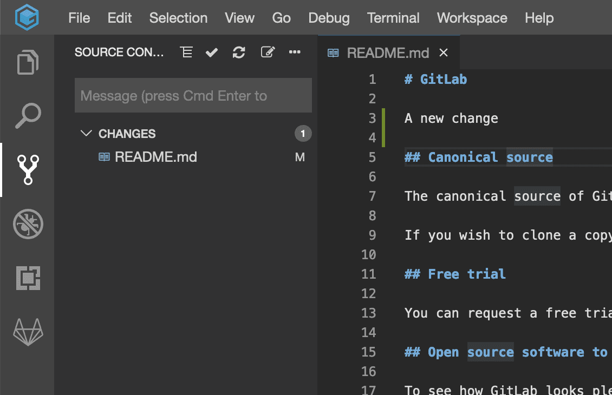
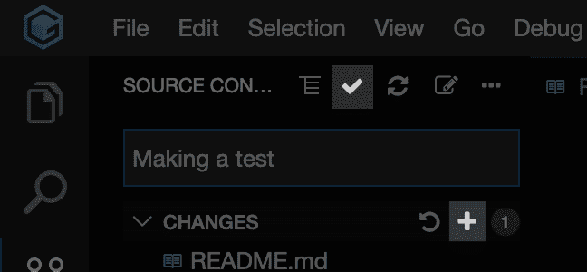
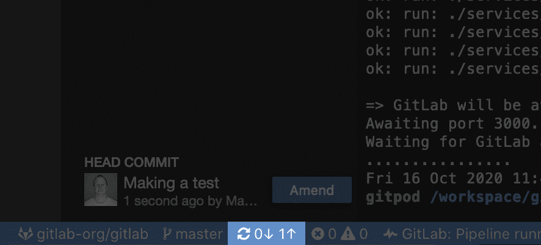

# GDK with Gitpod

GDK can be used with [Gitpod](https://www.gitpod.io) using GitLab's
[Gitpod integration](https://docs.gitlab.com/ee/integration/gitpod.html).

The main advantage of running the GDK in Gitpod is that you don't have to worry about
your local environment, installing dependencies, and keeping them up to date. With
Gitpod, you can run a pre-configured GDK instance in the cloud, which also makes it
possible to contribute, no matter how powerful your machine is. You could even just use
an iPad!

## How to get started

**If you are a GitLab team member**, either:

- Open [this link](https://gitpod.io/#https://gitlab.com/gitlab-org/gitlab/).
- Click the **Gitpod** button in the [GitLab repository](https://gitlab.com/gitlab-org/gitlab/).
  This might require you to [enable the Gitpod integration](https://docs.gitlab.com/ee/integration/gitpod.html)
  in your user settings.

**If you are a community contributor**:

1. Fork the [GitLab repository](https://gitlab.com/gitlab-org/gitlab/),
1. Click the **Gitpod** button in the repository view of your fork.

Hint: If you don't see a "Gitpod" button, open the dropdown of the "Web IDE" split button.



If you have never used Gitpod before, you must:

1. Create a new Gitpod account.
1. Connect the Gitpod account to your GitLab account.

After that is done, you just wait 7-8 minutes for the entire setup to finish, and
you will see the GDK UI pop up in the right sidebar.



Sign in to GitLab running in GDK, and you are ready to make or review changes. If you
have questions about the UI or if you are curious have a look at:

- [Gitpod documentation](https://www.gitpod.io/docs/).
- [GDK commands documentation](../gdk_commands.md).

## How to use GDK with Gitpod

The following are common tasks for using GDK in Gitpod.

### Check out branches

The easiest way to switch to another branch is to use the UI functionality:

1. Click on the current branch name in the blue bottom bar.

   

1. A context menu will appear with a list of other branches where you can type in
   the name of the branch you want to switch to and select it as soon as it appears in
   the list.

   

Alternatively, you can also use the terminal to check out a branch:

```shell
git fetch origin
git checkout -b "BRANCH_NAME" "origin/BRANCH_NAME"
```

### Commit and push changes

If you have made changes to any of the files and want to push and commit them:

1. Navigate to the **Source Control: Git** tab in the left sidebar. There you will also
   see all files that have been changed.

   

1. In this view, you can then decide which changes you want to add to the commit.
   Usually that would be all files, so you can just stage all changes by clicking on
   the "Plus" icon that appears on hover next to the **Changes** section.
1. When that's done and you have also entered a commit message in the text area above,
   you can commit by clicking the checkmark icon at the top of the **Source Control**
   section.

   

1. Push your changes by using the **Synchronize changes** action in the bottom
   blue toolbar. If the Gitpod UI asks you which way you want to synchronize your
   changes, you can just choose **Push and pull**.

   

## Configure additional features

With Gitpod, the default configuration of the GDK is ready for you in just a couple of
minutes, and we are actively working on making sure that as many features work out of
the box. However, right now you still have to complete a couple of steps to enable
advanced features.

### Enable runners

As a first step you have to recover the secrets file, follow these steps from the terminal of the Gitpod UI:

1. Run  `cd ../gitlab && ./bin/rails console`.
1. Wait about one minute until you see the message that the development environment
   has been loaded, then run `ApplicationSetting.current.reset_runners_registration_token!`.
1. Leave the console by typing `exit` and hitting Enter.
1. Run `bundle exec rails dbconsole` and wait about 1 minute until you see the
   `gitlabhq_development=#` prompt, then run the following commands:
   1. `UPDATE projects SET runners_token = null, runners_token_encrypted = null;`
   1. `UPDATE namespaces SET runners_token = null, runners_token_encrypted = null;`
   1. `UPDATE application_settings SET runners_registration_token_encrypted = null;`
   1. `UPDATE ci_builds SET token = null, token_encrypted = null;`
1. Leave the console again by typing `exit` and hitting Enter.

Having the secrets file recovered, you can now register and run a GitLab Runner:

1. Switch to the GDK directory `(cd ../gitlab-development-kit)` and run
   `gdk reconfigure && gdk restart`.
1. Go to **Admin Area > Runners** in the GitLab running in GDK.
1. Click the **Reset runners registration token button**`*** and manually
   reload the page to be sure you are seeing the most up-to-date token.
1. Run `gitlab-runner register --run-untagged --config /workspace/gitlab-development-kit/gitlab-runner-config.toml`
   and enter the information from the GitLab UI running in GDK.
1. Run `gitlab-runner run --config /workspace/gitlab-development-kit/gitlab-runner-config.toml`.

Your runner is ready to pick up jobs for you! If you create a new project, the
**Pages/Plain HTML** template contains a super simple and tiny pipeline that's great to
use to verify whether the runner is actually working.

### Enable feature flags

To enable feature flags:

1. Run `cd ../gitlab && ./bin/rails console`.
1. Wait about 1 minute until you see the message that the development environment
   has been loaded.
1. Run `Feature.enable(:feature_flag)`, replacing `feature_flag` with the name of the
   feature flag you want to enable.
1. Leave the console by typing `exit` and hitting Enter.
