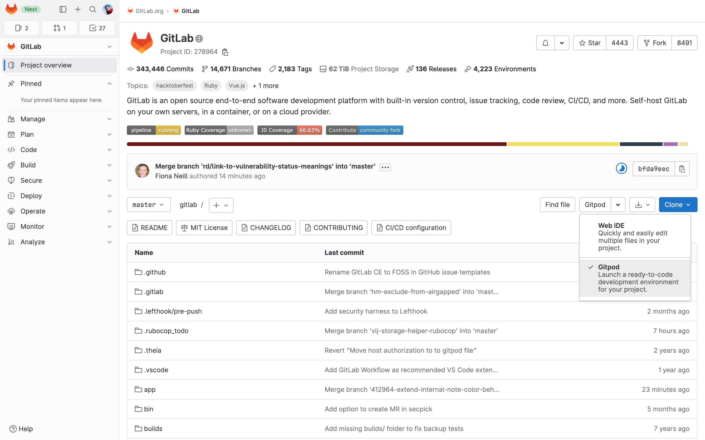
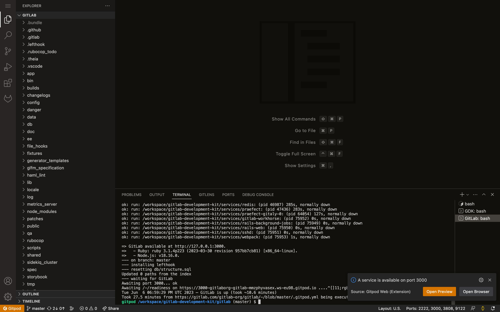
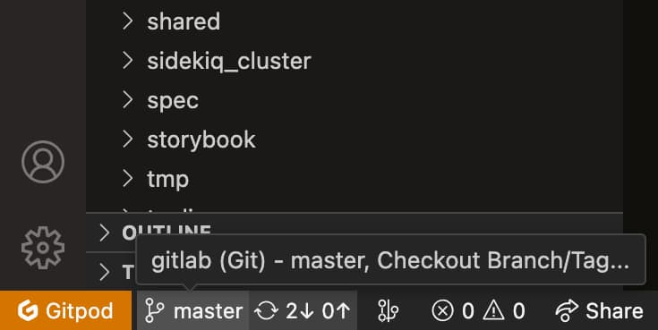
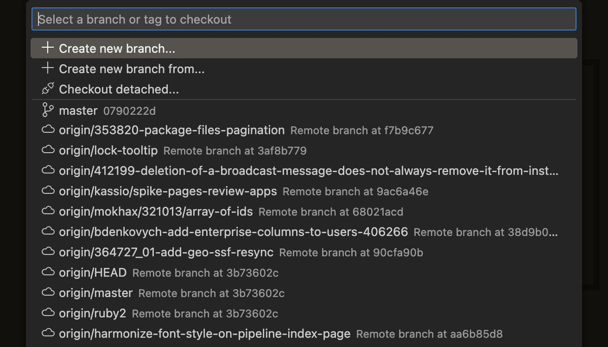
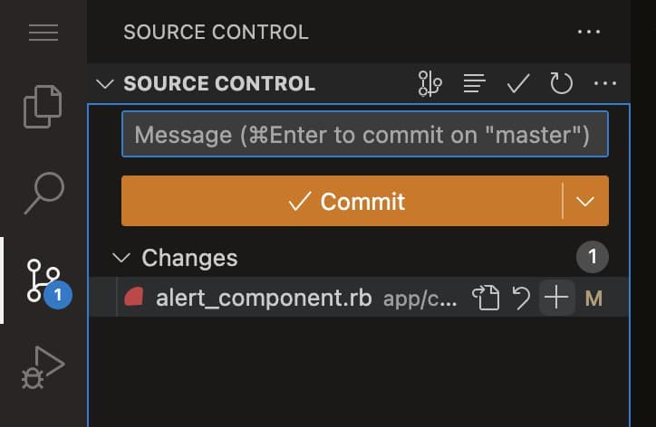
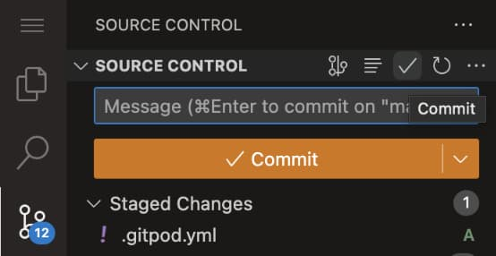
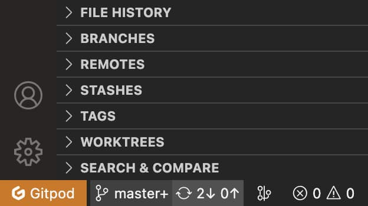

# GDK with Gitpod

GDK can be used with [Gitpod](https://www.gitpod.io) using the GitLab
[Gitpod integration](https://docs.gitlab.com/ee/integration/gitpod.html).

The main advantage of running the GDK in Gitpod is that you don't have to worry about
your local environment, installing dependencies, and keeping them up to date. With
Gitpod, you can run a pre-configured GDK instance in the cloud, which also makes it
possible to contribute, no matter how powerful your machine is. You could even just use
an iPad!

- [How to update the Gitpod GDK Docker image](#how-to-update-the-gitpod-gdk-docker-image)
- [How to get started](#how-to-get-started)

## How to get started

**If you are a GitLab team member**, either:

- Open [this link](https://gitpod.io/#https://gitlab.com/gitlab-org/gitlab/).
- Click the **Gitpod** button in the [GitLab repository](https://gitlab.com/gitlab-org/gitlab/).
  This might require you to [enable the Gitpod integration](https://docs.gitlab.com/ee/integration/gitpod.html)
  in your user settings.

**If you are a community contributor**:

1. Fork the [GitLab repository](https://gitlab.com/gitlab-org/gitlab/),
1. Click the **Gitpod** button in the repository view of your fork.

Hint: If you don't see a "Gitpod" button, open the dropdown of the "Web IDE" split button.



If you have never used Gitpod before, you must:

1. Create a new Gitpod account.
1. Connect the Gitpod account to your GitLab account.

After that is done, you just wait 7-8 minutes for the entire setup to finish, and
you'll see a notification on the bottom right corner to open the GDK UI, Open the port in browser.



Sign in to GitLab using the default username `root` and password `5iveL!fe`. You must
immediately change that password after you log in the first time. Every new Gitpod workspace
requires you to change the password again. Now you are ready to make or review changes.

If you have questions about the UI or if you are curious have a look at:

- [Gitpod documentation](https://www.gitpod.io/docs/).
- [GDK commands documentation](../gdk_commands.md).

## How to use GDK with Gitpod

The following are common tasks for using GDK in Gitpod.

### Check out branches

The easiest way to switch to another branch is to use the UI functionality:

1. Click on the current branch name in the blue bottom bar.

   

1. A context menu appears with a list of other branches where you can type in
   the name of the branch you want to switch to and select it as soon as it appears in
   the list.

   

Alternatively, you can also use the terminal to check out a branch:

```shell
git fetch origin
git checkout -b "BRANCH_NAME" "origin/BRANCH_NAME"
```

### Commit and push changes

If you have made changes to any of the files and want to push and commit them:

1. Navigate to the **Source Control: Git** tab in the left sidebar. There you also
   see all files that have been changed.

   

1. In this view, you can then decide which changes you want to add to the commit.
   Usually that would be all files, so you can just stage all changes by clicking on
   the "Plus" icon that appears on hover next to the **Changes** section.
1. When that's done and you have also entered a commit message in the text area above,
   you can commit by clicking the checkmark icon at the top of the **Source Control**
   section.

   

1. Push your changes by using the **Synchronize changes** action in the bottom
   blue toolbar. If the Gitpod UI asks you which way you want to synchronize your
   changes, you can just choose **Push and pull**.

   

## Configure additional features

With Gitpod, the default configuration of the GDK is ready for you in just a couple of
minutes, and we are actively working on making sure that as many features work out of
the box. However, right now you still have to complete a couple of steps to enable
advanced features.

### Enable runners

You can add a runner with a Docker executor or a shell executor. You can also add multiple runners with different executors.

#### Option 1: Docker executor

1. To create a Docker runner, run the commands in [Use Docker volumes to start the Runner container](https://docs.gitlab.com/runner/install/docker.html#option-2-use-docker-volumes-to-start-the-runner-container) in Gitpod. The commands are also listed here:

   ```shell
   docker volume create gitlab-runner-config

   docker run -d --name gitlab-runner --restart always \
     -v /var/run/docker.sock:/var/run/docker.sock \
     -v gitlab-runner-config:/etc/gitlab-runner \
     gitlab/gitlab-runner:latest
   ```

1. Register the runner by running the interactive command mentioned in the [Docker section](https://docs.gitlab.com/runner/register/index.html#docker) under "For Docker volume mounts",
   and enter the appropriate values when asked.

   - For the GitLab instance URL, use `http://10.0.5.2:3000/`, which is the IP of the ceth0 interface in Gitpod.
   - For the default image, you can enter `alpine:latest`.

   Or use this non-interactive command to register your runner with all the required values pre-filled:

   ```shell
   cd /workspace/gitlab-development-kit/gitlab

   docker run --rm -it -v gitlab-runner-config:/etc/gitlab-runner gitlab/gitlab-runner:latest register \
     --non-interactive \
     --url "http://10.0.5.2:3000/" \
     --registration-token "$(bundle exec rails runner 'puts Gitlab::CurrentSettings.current_application_settings.runners_registration_token')" \
     --executor "docker" \
     --docker-image alpine:latest \
     --description "docker-runner" \
     --run-untagged="true"
   ```

1. Check that you're using the `3000` port and that it's set to public. You can change the port from private to public by
   going to the **Remote Explorer** tab in Gitpod and selecting the lock icon next to the port name.

#### Option 2: Shell executor

1. On the top bar, select **Main menu > Admin** in the GitLab UI running in GDK.
1. On the left sidebar, select **Overview > Runners**.
1. Ensure that you're using the 3000 port and that it's set to public. You can change the port from private to public by going to the
   **Remote Explorer** tab in Gitpod UI and selecting the lock icon next to the port name.
1. From the **Register an instance runner** dropdown, select **Show runner installation and registration instructions**.
1. Copy the **Command to register runner**.
1. In the terminal, switch to the GDK directory `cd /workspace/gitlab-development-kit`
1. Run the copied command with the following added to the end `--run-untagged --config /workspace/gitlab-development-kit/gitlab-runner-config.toml --non-interactive --executor shell`.
1. Run `gitlab-runner run --config /workspace/gitlab-development-kit/gitlab-runner-config.toml`.

Your runner is ready to pick up jobs for you! If you create a new project, the
**Pages/Plain HTML** template contains a super simple and tiny pipeline that's great to
use to verify whether the runner is actually working.

### Enable feature flags

To enable feature flags:

1. Run `cd ../gitlab && ./bin/rails console`.
1. Wait about 1 minute until you see the message that the development environment
   has been loaded.
1. Run `Feature.enable(:feature_flag)`, replacing `feature_flag` with the name of the
   feature flag you want to enable.
1. Leave the console by typing `exit` and hitting Enter.

### Enable the billing page

1. Open a [Rails console](rails_console.md).
1. Run `ApplicationSetting.first.update(check_namespace_plan: true)`.
1. Run `gdk restart` to apply the changes.

The billing page is now accessible at **Group > Settings > Billing**.

### Connect the Customer app to your Gitpod instance

Use the instructions in the [`customers-gitlab-com` project](https://gitlab.com/gitlab-org/customers-gitlab-com/-/blob/main/doc/setup/gitpod_installation.md).

### Use Advanced Search

To use Advanced Search, you must:

- Have a premium or higher license registered in the GDK.
- Enable Elasticsearch.

To enable Elasticsearch:

1. From the command line, navigate to `/workspace/gitlab-development-kit` and open
   `gdk.yml` for editing by using `cd /workspace/gitlab-development-kit && gp open gdk.yml`.
   The file might be empty.

1. Add the following lines and save the file:

   ```yaml
   elasticsearch:
      enabled: true
   ```

1. Run `gdk reconfigure`.
1. Run `gdk start elasticsearch`.

### How to test features only available in higher GitLab tiers

For information on enabling higher GitLab tiers in GDK to test out features, learn more about
[how to activate GitLab EE with a license file or key](https://docs.gitlab.com/ee/user/admin_area/license_file.html#add-your-license-file-during-installation).

### How to test features only available on SaaS (GitLab.com)

By default GDK runs as self-managed, but can be switched to run as the SaaS version. For more information, see [Simulate a SaaS instance](https://docs.gitlab.com/ee/development/ee_features.html#simulate-a-saas-instance).

## How to update the Gitpod GDK Docker image

There are two Gitpod GDK Docker images that can be built:

- `registry.gitlab.com/gitlab-org/gitlab-development-kit/gitpod-workspace:main`
- `registry.gitlab.com/gitlab-org/gitlab-development-kit/gitpod-workspace:stable`

### `main` tag

We automatically build a new Gitpod GDK Docker image every day that's tagged as
`registry.gitlab.com/gitlab-org/gitlab-development-kit/gitpod-workspace:main`.
The `main` tag is used because that's the name of the default Git branch for
the GDK.

### `stable` tag

When running [Gitpod for GitLab](https://gitlab.com/gitlab-org/gitlab), it uses the
[`registry.gitlab.com/gitlab-org/gitlab-development-kit/gitpod-workspace:stable`](https://gitlab.com/gitlab-org/gitlab/-/blob/master/.gitpod.yml#L1)
Docker image which uses the `stable` tag.

### Promote `main` tag to `stable`

1. Visit [GDK's scheduled CI pipelines](https://gitlab.com/gitlab-org/gitlab-development-kit/-/pipeline_schedules) and locate the last successful pipeline ID for the `Rebuild Gitpod workspace image` pipeline.
1. Use the pipeline ID to check if the GDK Gitpod `main` image was created.
1. Check the `verify-gitpod-docker-image` job succeeded to ensure GDK started successfully in GDK Gitpod `main` image.
1. Using the pipeline located in step 1, promote the GDK Gitpod `main` image to `stable` by selecting **Run** on the manual `deploy-gitpod-workspace-image` job once it is available.
