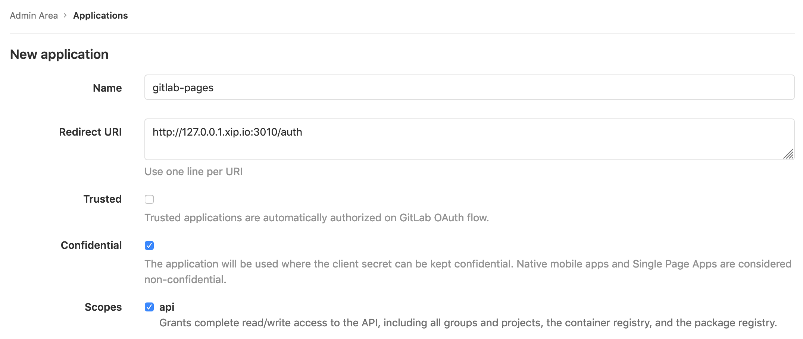
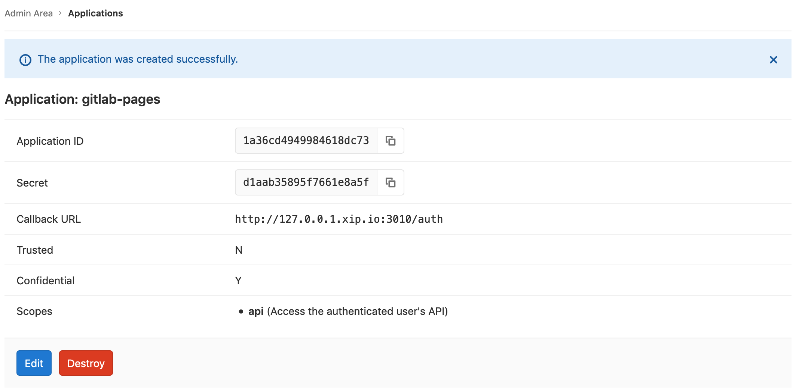

# GitLab as a OAuth provider for Pages

By default the Pages daemon does not authenticate against GitLab when running in the GDK.
This guide describes how to configure GitLab Pages to use authentication, and to use
GitLab GDK as an OAuth provider.

Available authentication options for GitLab can be [found here](https://gitlab.com/gitlab-org/gitlab-pages#configuration). This guide describes the use of a **config** file.

This guide assumes GitLab Pages has already been configured for local development.

Throughout this guide `<gdk root>` refers to the home directory of the local user. For example, on OS X with user `sean`, a possible value of `<gdk root>` could be `/Users/home/sean/gdk-ee/`. The GitLab domain, e.g.: `http://localhost:3000` is referred to as `<gdk domain>`.

## Setup GitLab as OAuth provider for Pages

Within User, Settings, Applications

- Name (anything)
- Scopes: api
- Url: http://127.0.0.1.xip.io:3010/auth





### Prepare Pages Configuration File

The authentication information is taken from the GitLab Pages OAuth application page.

- auth-client-id
  - Application ID
  - e.g. `1a36cd4949984618dc...`
- auth-client-secret
  - Secret
  - e.g. `d1aab35895f7661e8a5f...`
- auth-redirect-uri
  - Callback URL
  - e.g. `http://127.0.0.1.xip.io:3010/auth`
- auth-secret
  - An arbitrary secret, generated outside of GitLab
  - e.g. `f39836aef3e761fd3b150ced28605...`
- auth-server
  - `<gdk domain>`
  - e.g. `http://192.168.1.123:3000`


Example config file `pages-config`

```
auth-client-id=1a36cd4949984618dc...
auth-client-secret=d1aab35895f7661e8a5f...
auth-redirect-uri=http://127.0.0.1.xip.io:3010/auth
auth-secret=f39836aef3e761fd3b150ced28605...
auth-server=http://192.168.1.123:3000
```

### Run Pages from the GOPATH

Using the commented Pages command in the `Procfile` as a template, run Pages from the GOPATH, passing the **config** file.

```bash
cd `go env GOPATH`/src/gitlab.com/gitlab-org/gitlab-pages
go build && ./gitlab-pages -listen-http ":3010" -artifacts-server <gdk domain>/api/v4
-pages-root <gdk root>/gitlab/shared/pages/ -pages-domain 127.0.0.1.xip.io
-config=pages-config -log-verbose=1
```

## Enable Access Control in `gitlab.yml`

Edit `gitlab/config/gitlab.yml` and set the `pages.access_control` to `true`.

```
## GitLab Pages
pages:
  enabled: true
  access_control: true
  host: 127.0.0.1.xip.io
```

Restart GDK

```
gdk restart
```
