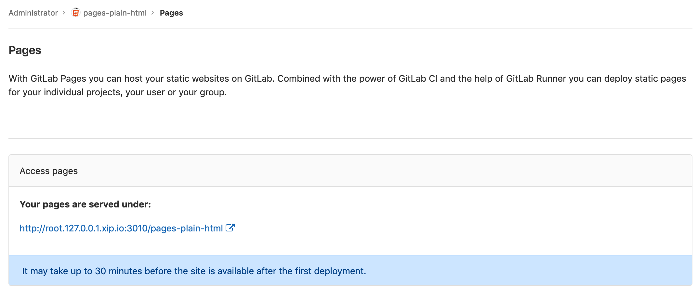

# Pages

GDK includes an HTTP-only gitlab pages daemon, running on port `3010`.

In order to handle wildcard hostnames, pages integration relies on
[xip.io](https://xip.io) and will not work on a disconnected system.

Port number can be customized editing `gdk.yml` as explained in
[GDK configuration](configuration.md#gdkyml).

## Configure GDK for Pages Development

The GDK bundles a GitLab pages instance, but it is also possible to perform Pages
development externally to the GDK. In order to do this, the GDK needs to point to
the Pages code in the external folder.

This guide assumes:

- Go [has been installed](https://golang.org/doc/installed).
- GitLab Runner [has been installed, registered](runner.md) and able to perform jobs.

The high-level steps are

- Clone the Pages repository
- Disable GDK-based Pages
- Create a Pages project
- Run Pages

Throughout this guide `<gdk root>` refers to the home directory of the local user. For example, on OS X with user `sean`, a possible value of `<gdk root>` could be `/Users/home/sean/gdk/`. The GitLab domain, e.g.: `http://localhost:3000` is referred to as `<gdk domain>`.

The folder that Pages has been installed into is referred to as `<pages home>`.

### Clone Pages locally

```bash
git clone git@gitlab.com:gitlab-org/gitlab-pages.git
```

Test the configuration by compiling and running the tests:

```bash
cd `<pages home>`
go build && go test ./...
```

### Create a Pages Project

Launch the GDK, then create a sample GitLab Pages project from template.

- Projects, New Project
- Create from template
- Pages/Plain HTML

Run a Pipeline to deploy the project

- CI / CD, Pipelines, Run Pipeline

Once the Pipeline has run, the site will be deployed. Access the settings page to find the url.

- Project, Settings, Pages



Visit the Pages url to view the site.

### Disable GDK-bundled Pages

Stop the GDK
```bash
gdk stop
```

Edit the `Procfile` and comment out the reference to the GDK-bundled Pages. Take a
note of this command, as we will use it as a template to launch the local Pages instance.

```
# gitlab-pages: exec gitlab-pages/bin/gitlab-pages -listen-http ":3010" -artifacts-server http://0.0.0.0:3000/api/v4 -pages-root  <gdk root>/gitlab/external-pages-gdk/gitlab/shared/pages -pages-domain 127.0.0.1.xip.io
```

Restart the GDK
```bash
gdk start
```

### Run Pages locally

Using the commented-out Pages command in the `Procfile` as a template, run Pages from `<pages home>`.

```bash
cd `<pages home>`
go build && ./gitlab-pages -listen-http ":3010" -artifacts-server <gdk domain>/api/v4 -pages-root <gdk root>/gitlab/shared/pages/ -pages-domain 127.0.0.1.xip.io -log-verbose=1
```

Visit the Pages url again, and see the site rendered by the local instance of Pages.
