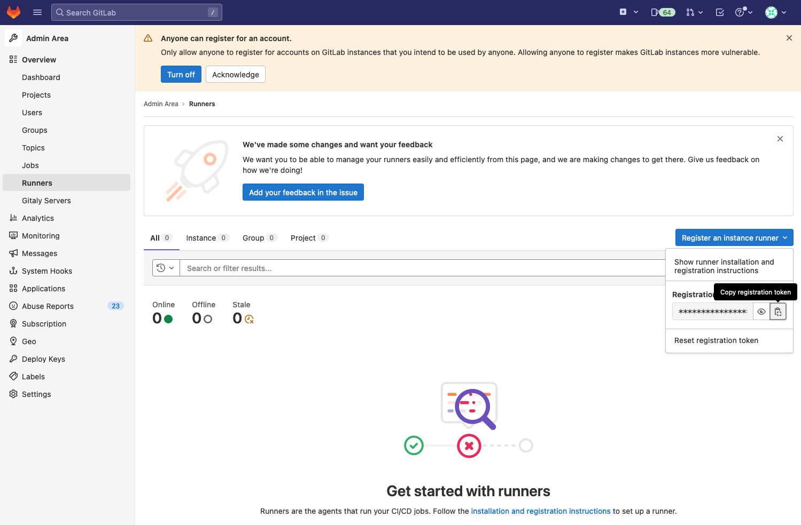
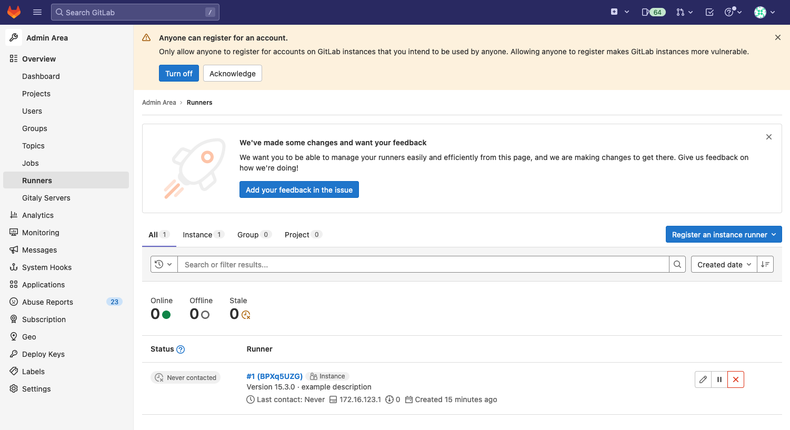
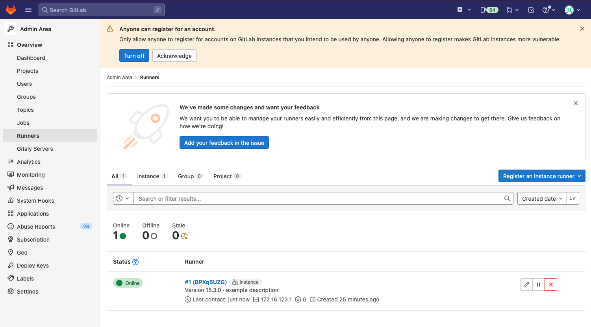
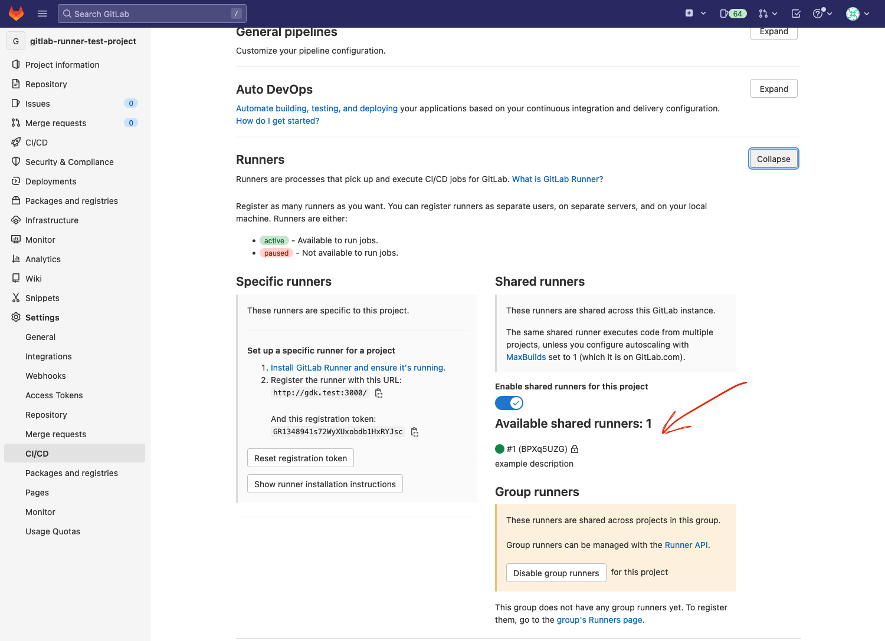

# Using GitLab Runner with GDK

Most features of [GitLab CI/CD](http://docs.gitlab.com/ee/ci/) need a
[runner](http://docs.gitlab.com/ee/ci/runners/README.html) to be registered with
the GitLab installation. This how-to takes you through the necessary steps to
do so when GitLab is running under GDK.

Before setting up a runner, you must have [set up the GDK](../index.md) for your workstation.

You can set up:

- A runner to run directly on your workstation
- A runner in Docker.

The GDK supports managing the runner configuration file and the process itself, either with a native binary
or within a Docker container. Running jobs inside a Docker executor is supported in both cases; you can use a native
binary to run jobs inside a Docker container.

We outline the steps for setting up each of these separately.

- [Simple configuration](#simple-configuration) (if you only need trivial jobs to run)
- [Docker configuration](#docker-configuration) (recommended)

NOTE:
In the configuration examples, `runner` should not be confused with [`gitlab_runner`](gitlab_docs.md).

## Simple configuration

If you intend to just use the `shell` executor (fine for simple jobs), you can use the GDK with its default settings.
Builds run directly on the host computer. If you choose this configuration, don't use random `.gitlab-ci.yml`
files from the internet unless you understand them fully as this could be a security risk. If you need a basic pipeline,
see an [example configuration from our documentation](https://docs.gitlab.com/ee/ci/environments/#configure-manual-deployments) that
you can use.

### Download GitLab Runner

Before you register a runner in your GDK, you first must have a runner binary either:

- Pre-built. To use a pre-built binary, follow [the runner installation instructions](https://docs.gitlab.com/runner/install/#binaries)
  for your specific operating system. Avoid following the instructions in the **Containers** section, as it's simpler
  to let the GDK manage the runner process.
- Compiled from source. To build from source, follow [the runner development instructions](https://docs.gitlab.com/runner/development/).
  See the official [GitLab Runner repository](https://gitlab.com/gitlab-org/gitlab-runner).

By default, GDK expects the runner binary to be at `/usr/local/bin/gitlab-runner`. To specify a custom `gitlab-runner`
binary location, add the following to `gdk.yml`:

```yaml
runner:
  bin: <path_to_gitlab_runner_binary>/gitlab-runner-darwin-amd64
```

### Set up a local runner

With a local runner installed, run `gitlab-runner register --run-untagged --config <path-to-gdk>/gitlab-runner-config.toml`
(as your normal user), and follow the prompts:

- **coordinator URL**: Use `http://localhost:3000/`, or `http://<custom_IP_address>:3000/` if you customized your IP
  address.
- **token**: Value of **Registration token** copied from `<coordinator-url>/admin/runners`.
- **description** (optional): A description of the runner. Defaults to the hostname of the machine.
- **tags** (optional): Comma-separated tags. Jobs can be set up to use only runners with specific tags.
- **executor**: Because we are running directly on the host computer, choose `shell`.

The runner writes its configuration file to `gitlab-runner-config.toml`, which is in GDK's `.gitignore` file.

To ensure the runner token persists between subsequent runs of `gdk reconfigure`, add the token (from `gitlab-runner-config.toml`,
not the **Registration token**), to your `gdk.yml` file and set `executor` to `shell`:

```yaml
runner:
  enabled: true
  executor: shell
  token: <runner-token>
```

Finally, run `gdk update` to rebuild your `Procfile`. This allows you to manage the runner along with your other GDK processes.

Alternately, run `gitlab-runner --log-level debug run --config <path-to-gdk>/gitlab-runner-config.toml`
to get a long-lived runner process, using the configuration you created in the
last step. It stays in the foreground, outputting logs as it executes
builds, so run it in its own terminal session.

The **Runners** page (`/admin/runners`) now lists the runners. Create a project in the GitLab UI and add a
[`.gitlab-ci.yml`](https://docs.gitlab.com/ee/ci/examples/) file,
or clone an [example project](https://gitlab.com/groups/gitlab-examples), and
watch as the runner processes the builds just as it would on a "real" install!

## Docker configuration

Instead of running GitLab Runner locally on your workstation, you can run it using Docker. This approach allows you to get an isolated environment for a job to run in. That prevents the job from interfering with your local workstation environment, and vice versa. It is safer than running directly on your computer, as the runner does not have direct access to your computer.

Look at the process overview below:

1. [Set up a local network](#set-up-a-local-network) - preferably to run GDK on `http://gdk.test:3000`
1. [Set up a runner](#set-up-a-runner) - you need to generate a runner config file
1. [Set up GDK to use the registered runner](#set-up-gdk-to-use-the-registered-runner) - configure GDK to manage a Docker runner

### Set up a local network

To use the Docker configuration for your runner, you first need to make sure your GDK **DOES NOT** run on the default `localhost` or `127.0.0.1` address, because it will clash with the routing inside a Docker container, so a runner/job won't be able to reach your GDK and fail with `connection refused` error. In order to set up local network follow the instructions in [Create a loopback interface](local_network.md#create-loopback-interface).

Verify that you're able to run GDK on the `gdk.test` domain listening to an IP **OTHER THAN** `127.0.0.1` (if you followed the example above, it should be `172.16.123.1`).

### Set up a runner

Now when we have GDK running on something like `http://gdk.test:3000` we can set up a runner. GDK will manage a dockerized runner for you, the only thing we need is to generate a runner token, which we can find in a config generated in the process of registering a runner.

To [register a runner](https://docs.gitlab.com/runner/register/index.html#docker) in
your GDK, you can run the `gitlab/gitlab-runner` Docker image. You **must
ensure** that the runner saves the configuration to a file that is
accessible to the host after the registration is complete. Here we use
`/tmp/gitlab-runner` as an example:

```shell
mkdir /tmp/gitlab-runner
docker run --rm -it -v /tmp/gitlab-runner:/etc/gitlab-runner gitlab/gitlab-runner register --run-untagged
```

<details>
<summary>Option for SSL users (expand)</summary>

(optional) If you have [SSL enabled with NGINX](nginx.md), a Docker-based runner needs access to your self-signed
certificate (for example, `gdk.test.crt`). Your certificate **must** have a `.crt` extension, _not_ `.pem`. GDK will
automatically mount your certificate into the Docker container when the runner is started, but you need to include it
manually when registering your runner:

```shell
docker run --rm -it -v "$(pwd)/gdk.test.crt:/etc/gitlab-runner/certs/gdk.test.crt" -v /tmp/gitlab-runner:/etc/gitlab-runner gitlab/gitlab-runner register --run-untagged
```

</details>
<p>

After you run this command you will be walked through a CLI wizard:

- **Enter the GitLab instance URL (for example, <https://gitlab.com/>)**: Use `http://gdk.test:3000/`, or `http://<custom_IP_address>:3000/` if you customized your IP
  address.
- **Enter the registration token**: Value of **Registration token** copied from `<gitlab-instance-url>/admin/runners`.
  
- **Enter a description for the runner** (optional): A description of the runner.
- **Enter tags for the runner (comma-separated)** (optional): Comma-separated tags. Jobs can be set up to use only runners with specific tags.
- **Enter optional maintenance note for the runner** (optional): Add anything related to the maintenance of the runner here.
- **Enter an executor**: Because we are running our runner in Docker, choose `docker`.
- **Enter the default Docker image**: Provide a Docker image that will be used to run the job if no image is provided in a job definition.

After you've completed the registration process, your command line prompt will look something like this:

```shell
mkdir /tmp/gitlab-runner
docker run --rm -it -v /tmp/gitlab-runner:/etc/gitlab-runner gitlab/gitlab-runner register --run-untagged
mkdir: /tmp/gitlab-runner: File exists
Runtime platform                                    arch=arm64 os=linux pid=7 revision=bbcb5aba version=15.3.0
Running in system-mode.

Enter the GitLab instance URL (for example, https://gitlab.com/):
http://gdk.test:3000/
Enter the registration token:
<runner-token-from-screenshot-above>
Enter a description for the runner:
2f0ff81334c5: example description
Enter tags for the runner (comma-separated):

Enter optional maintenance note for the runner:
example maintenance note
Registering runner... succeeded                     runner=jf_FciGC
Enter an executor: parallels, ssh, docker+machine, kubernetes, custom, docker, docker-ssh, shell, virtualbox, docker-ssh+machine:
docker
Enter the default Docker image (for example, ruby:2.7):
ruby:2.7
Runner registered successfully. Feel free to start it, but if it's running already the config should be automatically reloaded!

Configuration (with the authentication token) was saved in "/etc/gitlab-runner/config.toml"
```

Once the registration is complete, you should see the registered runner on the admin page:


### Set up GDK to use the registered runner

Now when the runner is registered we can find the token in `/tmp/gitlab-runner/config.toml`. (If you can't find the file, please refer to the [Troubleshooting section](#troubleshooting-tips) at the bottom of this page.)

For example:

```shell
# grep token /tmp/gitlab-runner/config.toml
token = "<runner-token>"
```

The GDK manages a runner in a Docker container for you, but it needs
this token in your `gdk.yml` file. Edit the `gdk.yml` to use this value
and set `install_mode` and `executor` to `docker`. You should also set the `extra_hosts` value as a hostname to the IP mapping you've used to register the runner (`gdk.test` in our example):

```yaml
runner:
  enabled: true
  install_mode: docker
  executor: docker
  token: <runner-token>
  extra_hosts: ["gdk.test:172.16.123.1"]
```

<details>
<summary>Optional step for SSL users (expand)</summary>
For SSL users, the GDK configures the Docker runner with
[`tls_verify`](https://docs.gitlab.com/runner/configuration/advanced-configuration.html#the-runnersdocker-section)
set to `false`, so SSL verification is disabled by
default.
</details>
<p/>

Run

```shell
gdk reconfigure
```

which will create `<path-to-gdk>/gitlab-runner-config.toml` in your GDK directory and enable the runner inside a Docker container.

After that just run

```shell
gdk restart
```

to apply the new configuration and verify that the runner is connected:


You should also be able to see the runner container up and running in `docker`:

```shell
docker ps
CONTAINER ID   IMAGE                         COMMAND                  CREATED              STATUS              PORTS     NAMES
c0ee80a6910e   gitlab/gitlab-runner:latest   "/usr/bin/dumb-init …"   About a minute ago   Up About a minute             festive_edison
```

From now on you can use `gdk start runner` and  `gdk stop runner` CLI commands to start and stop your runner.

Note that any changes in `gitlab-runner-config.toml` are lost after
every `gdk reconfigure`. If you need support for other configuration
settings, file a [GDK issue](https://gitlab.com/gitlab-org/gitlab-development-kit/-/issues) or
use a separate runner and configuration file for now.

You are good to go! Now you can assign the runner to a project and verify your jobs are running properly!

<details>
<summary>Here's how (expand):</summary>

1. Create a new project and ensure the new runner is available:
   
1. Add a `.gitlab-ci.yml` file like this one:

   ```yaml
   build-job:       # This job runs in the build stage, which runs first.
    stage: build
    script:
      - echo "Compiling the code..."
      - echo "Compile complete."
   ```

1. After you commit the `.gitlab-ci.yml` file, you can check if the CI job passed successfully in the `Jobs` section under the `CI/CD` folder in your project.

</details>

### Alternative method for Linux

An alternative to creating the dummy interface described above is to:

1. Add the following to your `gdk.yml`

    ```yaml
    runner:
      network_mode_host: true
    ```

1. Run `gdk reconfigure`

This will add `network_mode = host` to the `gitlab-runner-config.toml` file:

```toml
[[runners]]
  [runners.docker]
    ...
    network_mode = "host"
```

Note that this method:

- [Only works with Linux hosts](https://docs.docker.com/network/host/).
- Exposes your local network stack to the Docker container, which may be a security issue. Use
  it only to run jobs on projects that you trust.
- Won't work with Docker containers running in Kubernetes because Kubernetes uses its own
  internal network stack.

### Put it all together

At the end of all these steps, your config files should look something like this:

<details>
<summary>(expand)</summary>

`/tmp/gitlab-runner/config.toml`

```toml
   concurrent = 1
   check_interval = 0

   [session_server]
     session_timeout = 1800

   [[runners]]
     name = "example description"
     url = "http://gdk.test:3000/"
     id = 1
     token = "<runner-token>"
     token_obtained_at = 2022-09-22T07:34:57Z
     token_expires_at = 0001-01-01T00:00:00Z
     executor = "docker"
     [runners.custom_build_dir]
     [runners.cache]
       [runners.cache.s3]
       [runners.cache.gcs]
       [runners.cache.azure]
     [runners.docker]
       tls_verify = false
       image = "ruby:2.7"
       privileged = false
       disable_entrypoint_overwrite = false
       oom_kill_disable = false
       disable_cache = false
       volumes = ["/cache"]
       shm_size = 0
```

`gdk.yaml`

```yaml
---
hostname: gdk.test
listen_address: 172.16.123.1
runner:
  enabled: true
  install_mode: docker
  executor: docker
  token: <runner-token>
  extra_hosts: ["gdk.test:172.16.123.1"]
```

</details>
<p>

### Troubleshooting tips

- In the GitLab Web interface, check `/admin/runners` to ensure that
  your runner has contacted the server. If the runner is there but
  offline, this suggests the runner registered successfully but is now
  unable to contact the server via a `POST /api/v4/jobs/request` request.
- Run `gdk tail runner` to look for errors.
- Check that the runner can access the hostname specified in `gitlab-runner-config.toml`.
- Select `Edit` on the desired runner and make sure the `Run untagged jobs` is unchecked. Runners
  that have been registered with a tag may ignore jobs that have no tags.
- Run `tail -f gitlab/log/api_json.log | grep jobs` to see if the runner is attempting to request CI jobs.
- If you are using [Colima](https://gitlab.com/-/snippets/2259133) instead of Docker Desktop, and noticed that nothing is written to `/tmp/gitlab-runner`, you need to ensure that `/tmp/gitlab-runner` is writable by Colima. For further details/instructions, refer to this comment about [Troubleshooting GitLab Runner + Docker using Colima](https://gitlab.com/-/snippets/2259133#note_1123128579).
